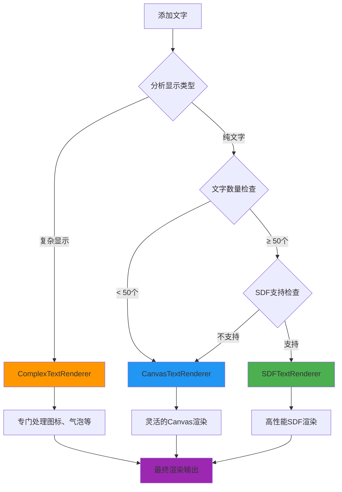

# OpenGL ES 2.0 复杂文字渲染完整指南

## 📋 概述

本指南详细介绍如何使用升级版的混合文字渲染系统来处理项目中的复杂文字显示需求，包括图标、气泡等多种元素的组合显示。

## 🎯 支持的显示类型

### 1. 纯文字显示 ✅
```kotlin
// 最简单的文字显示
val textInfo = TextRenderingUtils.createTextInfo("地标1", x = 10.0, y = 20.0)
textRenderer.addText(textInfo)
```

### 2. 图标+文字组合 ✅

#### 上方图标，下方文字
```kotlin
val textInfo = TextRenderingUtils.createIconTextInfo(
    content = "餐厅",
    x = 10.0, y = 20.0,
    iconResourceId = R.drawable.ic_restaurant,
    iconPosition = IconPosition.ABOVE,
    iconSize = Pair(24, 24)
)
textRenderer.addText(textInfo)
```

#### 左侧图标，右侧文字
```kotlin
val textInfo = TextRenderingUtils.createIconTextInfo(
    content = "加油站",
    x = 15.0, y = 25.0,
    iconResourceId = R.drawable.ic_gas_station,
    iconPosition = IconPosition.LEFT,
    iconSize = Pair(20, 20)
)
textRenderer.addText(textInfo)
```

### 3. 气泡文字显示 ✅

#### 基础气泡
```kotlin
val textInfo = TextRenderingUtils.createBubbleTextInfo(
    content = "重要提示",
    x = 5.0, y = 15.0,
    bubbleStyle = TextRenderingUtils.BubbleStyles.WARNING
)
textRenderer.addText(textInfo)
```

#### 自定义气泡样式
```kotlin
val customBubbleStyle = BubbleStyle(
    backgroundColor = Color.parseColor("#E3F2FD"),
    borderColor = Color.parseColor("#2196F3"),
    borderWidth = 2f,
    shadowColor = Color.parseColor("#33000000"),
    shadowRadius = 6f
)

val textInfo = TextRenderingUtils.createBubbleTextInfo(
    content = "自定义样式",
    x = 20.0, y = 30.0,
    bubbleStyle = customBubbleStyle
)
textRenderer.addText(textInfo)
```

### 4. 气泡+图标+文字组合 ✅
```kotlin
val textInfo = TextRenderingUtils.createBubbleIconTextInfo(
    content = "医院",
    x = 25.0, y = 35.0,
    iconResourceId = R.drawable.ic_hospital,
    bubbleStyle = TextRenderingUtils.BubbleStyles.ERROR,
    iconSize = Pair(18, 18)
)
textRenderer.addText(textInfo)
```

## 🎭 智能渲染策略



## 🚀 完整使用示例

### 场景一：新建地图 - 混合文字类型

```kotlin
class MixedTextMapRenderer : GLSurfaceView.Renderer {
    private lateinit var textRenderer: HybridTextRenderer
    
    override fun onSurfaceCreated(gl: GL10?, config: EGLConfig?) {
        // 创建智能混合渲染器
        textRenderer = TextRenderingFactory.createRecommendedRenderer(
            context = this@Activity,
            scenario = RenderingScenario.NewMapScenario,
            config = TextRenderingUtils.getRecommendedConfig(this@Activity)
        )
    }
    
    fun addVariousTexts() {
        // 1. 添加纯文字地标
        val simpleTexts = listOf("北京", "上海", "广州", "深圳")
        simpleTexts.forEachIndexed { index, text ->
            val textInfo = TextRenderingUtils.createTextInfo(
                content = text,
                x = index * 5.0, y = 0.0,
                style = TextStyle(fontSize = 16f, textColor = Color.WHITE)
            )
            textRenderer.addText(textInfo)
        }
        
        // 2. 添加带图标的POI
        val poiWithIcons = listOf(
            Triple("餐厅", R.drawable.ic_restaurant, IconPosition.ABOVE),
            Triple("加油站", R.drawable.ic_gas_station, IconPosition.LEFT),
            Triple("医院", R.drawable.ic_hospital, IconPosition.ABOVE),
            Triple("学校", R.drawable.ic_school, IconPosition.RIGHT)
        )
        
        poiWithIcons.forEachIndexed { index, (name, iconRes, position) ->
            val textInfo = TextRenderingUtils.createIconTextInfo(
                content = name,
                x = index * 6.0, y = 10.0,
                iconResourceId = iconRes,
                iconPosition = position,
                iconSize = Pair(24, 24),
                style = TextStyle(fontSize = 14f, textColor = Color.BLACK)
            )
            textRenderer.addText(textInfo)
        }
        
        // 3. 添加气泡提示
        val bubbleTexts = listOf(
            Triple("紧急通知", TextRenderingUtils.BubbleStyles.ERROR, 0.0),
            Triple("重要信息", TextRenderingUtils.BubbleStyles.WARNING, 8.0),
            Triple("成功消息", TextRenderingUtils.BubbleStyles.SUCCESS, 16.0),
            Triple("普通信息", TextRenderingUtils.BubbleStyles.INFO, 24.0)
        )
        
        bubbleTexts.forEach { (text, style, x) ->
            val textInfo = TextRenderingUtils.createBubbleTextInfo(
                content = text,
                x = x, y = 20.0,
                bubbleStyle = style,
                style = TextStyle(fontSize = 12f, textColor = Color.WHITE)
            )
            textRenderer.addText(textInfo)
        }
        
        // 4. 添加复杂的气泡+图标组合
        val complexItems = listOf(
            Triple("紧急救援", R.drawable.ic_emergency, TextRenderingUtils.BubbleStyles.ERROR),
            Triple("重要通知", R.drawable.ic_notification, TextRenderingUtils.BubbleStyles.WARNING)
        )
        
        complexItems.forEachIndexed { index, (text, iconRes, bubbleStyle) ->
            val textInfo = TextRenderingUtils.createBubbleIconTextInfo(
                content = text,
                x = index * 15.0, y = 30.0,
                iconResourceId = iconRes,
                bubbleStyle = bubbleStyle,
                iconSize = Pair(20, 20),
                style = TextStyle(fontSize = 14f, textColor = Color.WHITE)
            )
            textRenderer.addText(textInfo)
        }
        
        Log.d("TextRenderer", "添加了各种类型的文字，总计: ${getTotalTextCount()}")
    }
    
    private fun getTotalTextCount(): Int {
        return textRenderer.getTextCount()
    }
    
    override fun onDrawFrame(gl: GL10?) {
        GLES20.glClear(GLES20.GL_COLOR_BUFFER_BIT or GLES20.GL_DEPTH_BUFFER_BIT)
        
        // 智能渲染：自动选择最优的渲染策略
        textRenderer.render(mvpMatrix)
        
        // 可选：性能监控
        val stats = textRenderer.getPerformanceStats()
        val status = textRenderer.getRenderingStatus()
        
        if (stats.renderTime > 16f) { // 超过一帧时间
            Log.w("Performance", """
                性能警告: 
                - 渲染时间: ${stats.renderTime}ms
                - 内存占用: ${stats.memoryUsage / 1024 / 1024}MB
                - 复杂文字: ${stats.complexTextCount}/${stats.textCount}
                - 当前策略: ${status.strategy}
            """.trimIndent())
        }
    }
}
```

### 场景二：扩展地图 - 批量显示复杂文字

```kotlin
class ExtendedMapWithComplexTexts {
    
    fun loadMapWithExistingData() {
        // 已有的地图数据（混合类型）
        val existingSimpleTexts = listOf("地标1", "地标2", "地标3", "地标4", "地标5")
        
        // 创建扩展地图渲染器
        val renderer = TextRenderingFactory.createRecommendedRenderer(
            context = this,
            scenario = RenderingScenario.ExtendMapScenario(existingSimpleTexts)
        )
        
        // 批量添加复杂文字
        addComplexTextsBatch(renderer)
    }
    
    private fun addComplexTextsBatch(renderer: HybridTextRenderer) {
        // 批量创建气泡文字网格
        val bubbleTexts = listOf("警告1", "警告2", "警告3", "警告4")
        val bubbleGrid = TextRenderingUtils.createBubbleGridTextInfos(
            texts = bubbleTexts,
            rows = 2, cols = 2,
            spacing = 10.0,
            bubbleStyle = TextRenderingUtils.BubbleStyles.WARNING,
            style = TextStyle(fontSize = 12f, textColor = Color.BLACK)
        )
        
        renderer.addTexts(bubbleGrid)
        
        // 批量创建图标文字
        val iconTexts = listOf("餐厅1", "餐厅2", "餐厅3")
        val iconTextInfos = iconTexts.mapIndexed { index, text ->
            TextRenderingUtils.createIconTextInfo(
                content = text,
                x = index * 8.0, y = 40.0,
                iconResourceId = R.drawable.ic_restaurant,
                iconPosition = IconPosition.ABOVE,
                iconSize = Pair(24, 24),
                style = TextStyle(fontSize = 14f, textColor = Color.BLUE)
            )
        }
        
        renderer.addTexts(iconTextInfos)
        
        Log.d("ExtendedMap", "批量添加完成: 气泡文字${bubbleGrid.size}个, 图标文字${iconTextInfos.size}个")
    }
}
```

## 🎨 最佳实践建议

### 1. 显示类型选择策略

```kotlin
object DisplayTypeSelector {
    
    /**
     * 根据内容重要性选择显示类型
     */
    fun selectDisplayType(
        content: String, 
        importance: ImportanceLevel,
        hasIcon: Boolean = false
    ): TextDisplayType {
        return when (importance) {
            ImportanceLevel.CRITICAL -> {
                // 关键信息：使用醒目的气泡+图标
                if (hasIcon) TextDisplayType.BUBBLE_TEXT_WITH_ICON
                else TextDisplayType.BUBBLE_TEXT_ONLY
            }
            ImportanceLevel.HIGH -> {
                // 重要信息：使用图标增强
                if (hasIcon) TextDisplayType.ICON_ABOVE_TEXT
                else TextDisplayType.BUBBLE_TEXT_ONLY
            }
            ImportanceLevel.NORMAL -> {
                // 普通信息：简单显示
                if (hasIcon) TextDisplayType.ICON_LEFT_TEXT
                else TextDisplayType.PURE_TEXT
            }
            ImportanceLevel.LOW -> {
                // 次要信息：纯文字
                TextDisplayType.PURE_TEXT
            }
        }
    }
    
    /**
     * 根据内容类型选择气泡样式
     */
    fun selectBubbleStyle(contentType: ContentType): BubbleStyle {
        return when (contentType) {
            ContentType.ERROR -> TextRenderingUtils.BubbleStyles.ERROR
            ContentType.WARNING -> TextRenderingUtils.BubbleStyles.WARNING
            ContentType.SUCCESS -> TextRenderingUtils.BubbleStyles.SUCCESS
            ContentType.INFO -> TextRenderingUtils.BubbleStyles.INFO
            ContentType.DEFAULT -> TextRenderingUtils.BubbleStyles.DEFAULT
        }
    }
}

enum class ImportanceLevel { CRITICAL, HIGH, NORMAL, LOW }
enum class ContentType { ERROR, WARNING, SUCCESS, INFO, DEFAULT }
```

### 2. 性能优化建议

```kotlin
class PerformanceOptimizedTextManager {
    
    fun optimizeForDevice(context: Context): HybridConfig {
        val deviceLevel = TextRenderingUtils.getDevicePerformanceLevel(context)
        
        return when (deviceLevel) {
            DevicePerformanceLevel.HIGH -> HybridConfig(
                sdfThreshold = 100,          // 更多简单文字才切换SDF
                complexTextThreshold = 50,    // 支持更多复杂文字
                migrationDelay = 1500L,      // 更快迁移
                batchSize = 20               // 更大批次
            )
            DevicePerformanceLevel.MEDIUM -> HybridConfig(
                sdfThreshold = 60,           // 适中切换点
                complexTextThreshold = 25,    // 适中复杂文字数量
                migrationDelay = 3000L,      // 默认延迟
                batchSize = 12               // 适中批次
            )
            DevicePerformanceLevel.LOW -> HybridConfig(
                sdfThreshold = 30,           // 提前切换SDF
                complexTextThreshold = 10,    // 限制复杂文字数量
                migrationDelay = 5000L,      // 更长延迟
                batchSize = 5                // 更小批次
            )
        }
    }
    
    fun analyzeAndOptimize(textInfos: List<TextInfo>): OptimizationReport {
        val analysis = TextRenderingUtils.analyzeDisplayComplexity(textInfos)
        
        val recommendations = mutableListOf<String>()
        
        // 复杂度分析
        if (analysis.complexityRatio > 0.7f) {
            recommendations.add("复杂文字比例过高(${String.format("%.1f", analysis.complexityRatio * 100)}%), 考虑简化部分显示")
        }
        
        // 内存估算
        val estimatedMemory = TextRenderingUtils.estimateMemoryUsage(
            textCount = analysis.totalCount,
            avgTextLength = 6, // 假设平均6个字符
            renderType = TextRenderType.HYBRID_COMPONENT,
            complexityRatio = analysis.complexityRatio
        )
        
        if (estimatedMemory > 100 * 1024 * 1024) { // 超过100MB
            recommendations.add("预计内存占用过高(${estimatedMemory / 1024 / 1024}MB), 建议分批加载")
        }
        
        return OptimizationReport(analysis, estimatedMemory, recommendations)
    }
}

data class OptimizationReport(
    val complexity: DisplayComplexityAnalysis,
    val estimatedMemory: Long,
    val recommendations: List<String>
)
```

### 3. 实时性能监控

```kotlin
class RealTimePerformanceMonitor {
    private val performanceHistory = mutableListOf<PerformanceStats>()
    private val maxHistorySize = 100
    
    fun monitorPerformance(renderer: HybridTextRenderer) {
        Timer().schedule(object : TimerTask() {
            override fun run() {
                val stats = renderer.getPerformanceStats()
                val status = renderer.getRenderingStatus()
                
                // 记录性能数据
                recordPerformance(stats)
                
                // 分析性能趋势
                analyzePerformanceTrend(stats, status)
                
                // 输出监控报告
                logPerformanceReport(stats, status)
            }
        }, 0, 5000) // 每5秒监控一次
    }
    
    private fun recordPerformance(stats: PerformanceStats) {
        performanceHistory.add(stats)
        if (performanceHistory.size > maxHistorySize) {
            performanceHistory.removeAt(0)
        }
    }
    
    private fun analyzePerformanceTrend(stats: PerformanceStats, status: RenderingStatus) {
        if (performanceHistory.size < 5) return
        
        val recentStats = performanceHistory.takeLast(5)
        val avgRenderTime = recentStats.map { it.renderTime }.average()
        val memoryTrend = recentStats.map { it.memoryUsage }.zipWithNext { a, b -> b - a }.average()
        
        // 性能警告
        when {
            avgRenderTime > 20f -> {
                Log.w("Performance", "渲染时间持续过高: ${String.format("%.1f", avgRenderTime)}ms")
            }
            memoryTrend > 5 * 1024 * 1024 -> { // 每5秒增长超过5MB
                Log.w("Performance", "内存增长过快: ${memoryTrend / 1024 / 1024}MB/5s")
            }
            stats.complexTextCount.toFloat() / stats.textCount > 0.8f -> {
                Log.w("Performance", "复杂文字比例过高: ${String.format("%.1f", stats.complexTextCount.toFloat() / stats.textCount * 100)}%")
            }
        }
        
        // 策略建议
        if (status.strategy == "Canvas" && stats.textCount > 50) {
            Log.i("Performance", "建议：文字数量已达${stats.textCount}个，可考虑启用智能混合模式")
        }
    }
    
    private fun logPerformanceReport(stats: PerformanceStats, status: RenderingStatus) {
        Log.d("PerformanceMonitor", """
            ===== 性能监控报告 =====
            渲染时间: ${String.format("%.2f", stats.renderTime)}ms
            内存占用: ${stats.memoryUsage / 1024 / 1024}MB
            文字总数: ${stats.textCount} (复杂: ${stats.complexTextCount})
            当前策略: ${status.strategy}
            分布情况: Canvas(${status.canvasTextCount}) | SDF(${status.sdfTextCount}) | Complex(${status.complexTextCount})
            待迁移: ${status.pendingMigration}
            ========================
        """.trimIndent())
    }
}
```

## 🧩 资源与策略补充（与代码保持一致）

### 图标图集（多图集）
- 自动查询 `GL_MAX_TEXTURE_SIZE`，若查询失败兜底 2048。
- 采用等格单元拆分为多个图集，渲染时按 `textureId + UV` 分批，减少纹理绑定次数。

### 降级策略（可配置）
- 开关：`HybridConfig.allowDegrade`（默认 true）。
- 顺序：`HybridConfig.degradeOrder`（默认 `[ICON_ONLY, ICON_WITH_SHORT_TEXT, FULL_BUBBLE]`）。
- 短文本阈值：`HybridConfig.shortTextMaxWidthPx` 按像素裁切并自动追加省略号（默认 80px）。
- 禁止降级（`allowDegrade=false`）：屏内复杂对象超限时仍绘制完整气泡，保证一致性，可能牺牲帧率。

### SDF 字体回退策略
- `SDFTextRenderer.supportsText(text)` 对复杂脚本/Emoji/合字保守返回 false，自动回退 Canvas/Complex 路径，确保中英阿等 30+ 语言的正确形态与换行；Latin/CJK 等常见字符走 SDF 保障性能。

### 配置示例
```kotlin
// 智能混合渲染器 + 设备自适应 + 降级策略
val renderer = TextRenderingFactory.createRecommendedRenderer(context)
val config = HybridConfig(
    allowDegrade = true,
    degradeOrder = listOf(
        HybridTextRenderer.DegradeStep.ICON_ONLY,
        HybridTextRenderer.DegradeStep.ICON_WITH_SHORT_TEXT,
        HybridTextRenderer.DegradeStep.FULL_BUBBLE
    ),
    shortTextMaxWidthPx = 80f
)
renderer.initialize(RenderingScenario.NewMapScenario, config)
```

## 📊 性能对比

| 显示类型 | 内存占用 | 渲染时间 | 适用场景 | 推荐数量 |
|---------|---------|---------|---------|---------|
| **纯文字** | 低 | 快 | 大量地标 | 无限制 |
| **图标+文字** | 中 | 中等 | POI显示 | <500个 |
| **气泡文字** | 中等 | 中等 | 重要提示 | <200个 |
| **气泡+图标+文字** | 高 | 较慢 | 关键信息 | <100个 |

## ⚠️ 注意事项

### 1. 复杂度控制
```kotlin
// ❌ 避免：过多复杂文字
fun addTooManyComplexTexts() {
    repeat(1000) { // 太多了！
        val textInfo = TextRenderingUtils.createBubbleIconTextInfo(...)
        textRenderer.addText(textInfo)
    }
}

// ✅ 推荐：合理控制复杂文字数量
fun addReasonableComplexTexts() {
    // 只对真正重要的信息使用复杂显示
    val criticalInfos = getCriticalInfos() // 假设返回<50个
    criticalInfos.forEach { info ->
        val textInfo = TextRenderingUtils.createBubbleIconTextInfo(...)
        textRenderer.addText(textInfo)
    }
    
    // 其他信息使用简单显示
    val normalInfos = getNormalInfos()
    normalInfos.forEach { info ->
        val textInfo = TextRenderingUtils.createTextInfo(...)
        textRenderer.addText(textInfo)
    }
}
```

### 2. 内存管理
```kotlin
// ✅ 推荐：及时释放不需要的文字
fun cleanupUnnecessaryTexts() {
    val currentTexts = textRenderer.getPerformanceStats()
    
    if (currentTexts.memoryUsage > 50 * 1024 * 1024) { // 超过50MB
        // 移除屏幕外的文字
        removeOffScreenTexts()
        
        // 降级复杂显示
        downgradeComplexTexts()
    }
}
```

### 3. 设备适配
```kotlin
// ✅ 推荐：根据设备性能调整策略
fun adaptToDevice(context: Context) {
    val config = TextRenderingUtils.getRecommendedConfig(context)
    
    // 低端设备：限制复杂文字
    if (config.complexTextThreshold < 15) {
        Log.i("Adaptation", "低端设备，限制复杂文字使用")
        useSimpleDisplayOnly()
    }
}
```

## 🔧 故障排除

### Q1: 复杂文字显示不正确？
**A:** 检查图标资源和气泡配置：
```kotlin
// 确保图标资源存在
val iconExists = try {
    context.resources.getDrawable(iconResourceId, null)
    true
} catch (e: Exception) {
    Log.e("TextRenderer", "图标资源不存在: $iconResourceId")
    false
}

// 检查气泡配置
val bubbleInfo = BubbleInfo(
    style = BubbleStyle(
        backgroundColor = Color.WHITE, // 确保颜色有效
        borderWidth = if (borderWidth > 0) borderWidth else 1f // 确保边框宽度有效
    )
)
```

### Q2: 性能下降严重？
**A:** 分析并优化：
```kotlin
fun diagnosePerformance() {
    val stats = textRenderer.getPerformanceStats()
    val analysis = TextRenderingUtils.analyzeDisplayComplexity(getAllTexts())
    
    when {
        analysis.complexityRatio > 0.5f -> {
            Log.w("Performance", "复杂文字过多，考虑简化")
            simplifyComplexTexts()
        }
        stats.renderTime > 16f -> {
            Log.w("Performance", "渲染时间过长，考虑分批渲染")
            enableBatchRendering()
        }
        stats.memoryUsage > 100 * 1024 * 1024 -> {
            Log.w("Performance", "内存占用过高，清理无用文字")
            cleanupTexts()
        }
    }
}
```

### Q3: 文字混乱或重叠？
**A:** 调整布局和间距：
```kotlin
// 为复杂文字分配更大的空间
val spacing = when (displayType) {
    TextDisplayType.PURE_TEXT -> 1.0
    TextDisplayType.ICON_ABOVE_TEXT, TextDisplayType.ICON_LEFT_TEXT -> 2.0
    TextDisplayType.BUBBLE_TEXT_ONLY -> 2.5
    TextDisplayType.BUBBLE_TEXT_WITH_ICON -> 3.0
    else -> 1.5
}

val textInfos = TextRenderingUtils.createGridTextInfos(
    texts = texts,
    rows = rows, cols = cols,
    spacing = spacing
)
```

---

## 📞 技术支持

这个升级版的混合文字渲染系统能够智能地处理各种复杂的文字显示需求，通过合理使用不同的显示类型和渲染策略，可以在保证性能的同时提供丰富的视觉效果。

**记住**：选择合适的显示类型是关键 - 重要信息用复杂显示，普通信息用简单显示！🎯 

---

## 附录：HybridConfig 参数表（速查）

| 参数 | 类型/默认值 | 作用 |
|---|---|---|
| `sdfThreshold` | Int = 50 | 简单文字数量达到该阈值后倾向使用 SDF |
| `migrationDelay` | Long = 3000L | Canvas→SDF 迁移延迟（毫秒） |
| `batchSize` | Int = 10 | 迁移批次大小 |
| `complexTextThreshold` | Int = 20 | 复杂文字阈值（触发智能混合） |
| `allowDegrade` | Boolean = true | 是否允许复杂超限时降级 |
| `degradeOrder` | List = [ICON_ONLY, ICON_WITH_SHORT_TEXT, FULL_BUBBLE] | 降级顺序 |
| `shortTextMaxWidthPx` | Float = 80f | 短文本像素宽度阈值（截断+省略号） |
| `limitComplexPerScreen` | Int? = null | 屏内复杂对象上限（null=按设备档位） |
| `iconTextGapDp` | Float = 4f | 图标-文字间距（dp） |
| `paddingLeftDp` | Float = 8f | 气泡左内边距（dp） |
| `paddingTopDp` | Float = 6f | 气泡上内边距（dp） |
| `paddingRightDp` | Float = 8f | 气泡右内边距（dp） |
| `paddingBottomDp` | Float = 6f | 气泡下内边距（dp） |
| `arrowWidthDp` | Float = 12f | 箭头宽（dp） |
| `arrowHeightDp` | Float = 6f | 箭头高（dp） |
| `arrowAutoFlip` | Boolean = true | 贴边自动翻转箭头 |
| `gridSizeDp` | Float = 64f | 屏幕网格大小（dp） |
| `maxPerGrid` | Int = 1 | 每网格最大标注数 |
| `collisionWidthDp` | Float = 96f | 碰撞框宽（dp） |
| `collisionHeightDp` | Float = 32f | 碰撞框高（dp） |

注：图标多图集按 `GL_MAX_TEXTURE_SIZE` 自动拆分，失败兜底 2048；渲染按 `textureId+UV` 分批。