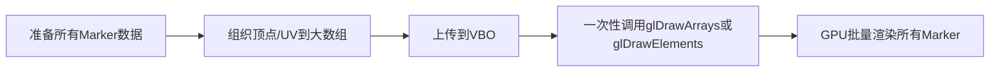

# OpenGL地图Marker批量渲染与高效文字渲染优化方案

## 背景

在地图类应用中，随着Marker（标记点）数量的增加（如2000+），传统的逐个绘制方式会导致性能瓶颈，主要体现在：
- 向GPU频繁提交绘制命令，CPU与GPU间通信成本高。
- 每个Marker单独上传顶点、纹理等数据，效率低下。
- 文字渲染采用Canvas生成Bitmap再上传为纹理，CPU和内存消耗大，且上传纹理频繁。

为提升渲染效率，需对Marker的绘制和文字渲染方式进行系统性优化。

---

## 一、Marker批量渲染（Batch Rendering）

### 1. 现有问题
- 每个Marker单独调用`glDrawArrays`，导致大量OpenGL状态切换和数据传输。
- 纹理切换频繁，影响渲染效率。

### 2. 优化方案
#### 2.1 批量提交顶点数据
- 使用VBO（Vertex Buffer Object）将所有Marker的顶点、纹理坐标等数据一次性上传到GPU。
- 每帧只需更新VBO内容（如Marker位置有变化）。
- 用`glDrawArrays`或`glDrawElements`一次性批量绘制所有Marker。

#### 2.2 纹理图集（Texture Atlas）
- 将所有Marker图标合成一张大纹理图（Atlas），每个Marker只需调整UV坐标即可使用不同图标。
- 渲染时只需绑定一次纹理，极大减少`glBindTexture`调用次数。

#### 2.3 分组渲染
- 若Marker种类极多，无法全部合成一张图集，可按纹理分组，分批渲染，进一步减少状态切换。

#### 2.4 Instanced Rendering（可选）
- 若Marker结构高度一致，可用OpenGL ES 3.0+的Instanced Rendering技术，进一步提升批量渲染效率。

### 3. 方案选择理由
- 批量提交大幅减少CPU与GPU间的通信次数，提升帧率。
- 纹理图集减少纹理切换，提升渲染吞吐量。
- 方案通用、易于维护，适合大规模Marker场景。

---

## 图例与代码说明

### 1. Marker批量渲染流程图



### 2. 纹理图集示意图

```
+-------------------------------+
|  图集Texture Atlas            |
|  +-----+ +-----+ +-----+      |
|  |  A  | |  B  | |  C  | ...  |
|  +-----+ +-----+ +-----+      |
+-------------------------------+
每个Marker只需调整UV坐标即可引用不同图标
```

### 3. 字体图集示意图

```
+-------------------------------------------------+
| 字体图集 Font Atlas                              |
| +---+---+---+---+---+---+---+---+---+---+       |
| | A | B | C | D | E | F | G | H | I | J | ...   |
| +---+---+---+---+---+---+---+---+---+---+       |
+-------------------------------------------------+
每个字符在图集中的UV坐标已知，拼接字符串时查表即可
```

---

## 关键代码片段说明

### 1. 批量Marker顶点数据组织与VBO上传

```kotlin
// 伪代码：批量组织所有Marker的顶点和UV数据
val markerCount = markers.size
val vertexData = FloatArray(markerCount * VERTEX_SIZE)
for (i in 0 until markerCount) {
    val marker = markers[i]
    // 计算marker的顶点坐标和UV（含图集偏移）
    // ...
    // 填充到vertexData数组
}
// 上传到VBO
vertexBuffer.put(vertexData).position(0)
glBindBuffer(GL_ARRAY_BUFFER, vboId)
glBufferData(GL_ARRAY_BUFFER, vertexData.size * 4, vertexBuffer, GL_DYNAMIC_DRAW)
```

### 2. 纹理图集UV坐标计算

```kotlin
// 伪代码：假设每个图标在图集中的位置和大小已知
fun getAtlasUV(iconIndex: Int): Pair<Float, Float> {
    // 计算UV偏移
    val u = (iconIndex % iconsPerRow) * iconWidth / atlasWidth
    val v = (iconIndex / iconsPerRow) * iconHeight / atlasHeight
    return Pair(u, v)
}
```

### 3. 字体图集UV查找与文字批量渲染

```kotlin
// 伪代码：将字符串拆分为字符，查找每个字符的UV
fun buildTextVertices(text: String): FloatArray {
    val vertices = mutableListOf<Float>()
    var cursorX = 0f
    for (char in text) {
        val uv = fontAtlas.getCharUV(char)
        // 计算每个字符的顶点和UV，拼接到vertices
        // ...
        cursorX += charWidth
    }
    return vertices.toFloatArray()
}
```

---

> 注：如需正式的流程图和图集示意图，可用设计工具绘制后插入文档。上述代码为伪代码，具体实现需结合实际项目结构调整。

---

## 二、高效文字渲染

### 1. 现有问题
- 每个Marker的文字用Canvas生成Bitmap再上传为纹理，CPU和内存消耗大，且上传纹理频繁。
- 文字内容多时，内存占用和渲染延迟明显。

### 2. 优化方案
#### 2.1 字体图集（Font Atlas）
- 预先生成一张包含所有常用字符的字体图集（如ASCII、常用汉字）。
- 记录每个字符在图集中的UV坐标。
- 绘制时，将字符串拆分为字符，查表获得每个字符的UV，拼接成顶点数据，一次性批量渲染。

#### 2.2 字符串缓存
- 对常用字符串生成纹理并缓存，避免重复生成和上传。
- 仅在文字内容变化时更新缓存。

#### 2.3 SDF字体渲染（可选）
- 使用SDF（Signed Distance Field）字体渲染，支持高质量缩放和抗锯齿，适合多缩放场景。

### 3. 方案选择理由
- 字体图集极大减少了Bitmap生成和纹理上传次数，提升渲染效率。
- 字符串缓存适合动态内容较少的场景，进一步减少CPU/GPU负担。
- SDF字体渲染兼顾高质量和高性能，适合对文字显示要求高的应用。

---

## 三、优化效果预期
- 单帧Marker渲染由2000次OpenGL调用减少为1~数十次，CPU占用显著降低。
- 文字渲染内存占用和延迟大幅下降，支持大规模动态文字显示。
- 整体渲染帧率提升，用户交互更流畅。

---

## 四、参考资料
- [OpenGL Instanced Rendering](https://learnopengl.com/Advanced-OpenGL/Instancing)
- [Texture Atlas for Sprites](https://en.wikipedia.org/wiki/Texture_atlas)
- [SDF Font Rendering](https://github.com/Chlumsky/msdfgen)
- [Android OpenGL 批量渲染示例](https://github.com/google/grafika)

---

## 五、后续可扩展方向
- 支持Marker动画、动态属性批量更新。
- 支持多层级LOD（Level of Detail）优化，远距离合并Marker。
- 结合GPU粒子系统等技术，进一步提升大规模渲染能力。 