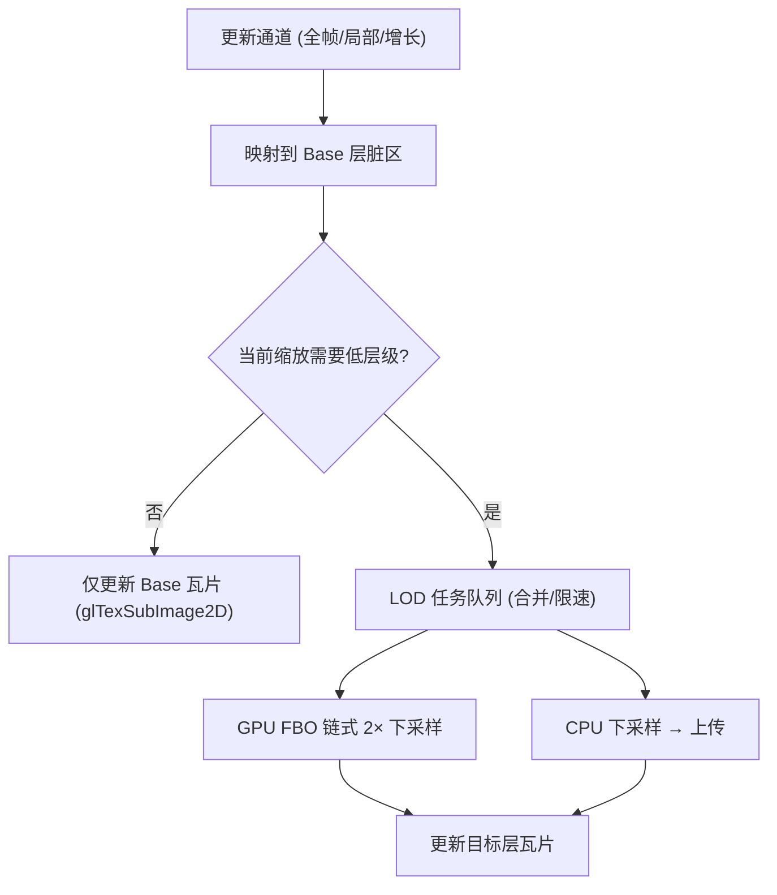

## Tile 与 LOD（金字塔）方案设计

本文档详细说明在 OpenGL ES 2.0 环境下的超大地图渲染方案：Tile（瓦片）与外部 LOD（金字塔）设计。内容包含原理、方案比较、实现要点、性能注意事项与示例。

### 为什么需要 Tile 与 LOD
- **OpenGL ES 2.0 限制**：`GL_MAX_TEXTURE_SIZE` 常见为 4096 或 8192，单张 20000×20000 纹理不可行。
- **内存与带宽**：一次上传/采样超大纹理不可控，GPU/CPU/IO 均吃紧。
- **交互性能**：缩放/平移/旋转时，应只对可见区域进行上传与采样，避免全图参与。

### 概念与目标
- **Tile（瓦片）**：将大图切分为固定大小（如 512×512）的子纹理，按需加载、上传、绘制与回收。
- **LOD（金字塔）**：为不同缩放级别准备不同分辨率的瓦片层，缩小时使用更低分辨率层以减少带宽与采样误差。
- **目标**：
  - 可渲染超大底图（20k×20k 以上）。
  - 交互流畅（≥30fps，目标 60fps）。
  - 内存可控（LRU、纹理池、按需加载）。
  - 动态更新友好（全帧/局部+懒生成 LOD）。

---

## 总体架构

```mermaid
flowchart TD
  A["手势/缩放/旋转"] --> B["相机矩阵/MapMatrix"]
  B --> C["视口 AABB (Map 空间)"]
  C --> D["TileManager"]
  D --> E["LOD 选择 (基于缩放/像素密度)"]
  E --> F["可见瓦片集合"]
  F --> G{ "缓存命中?" }
  G -- "命中" --> H["Renderer 渲染"]
  G -- "未命中" --> I["异步 IO 解码/加载"]
  I --> J["纹理上传 glTexImage2D/Pool"]
  J --> H
  H --> K["GLSurfaceView 屏幕"]
```



---

## 方案比较

- **外部 LOD（金字塔）+ 瓦片（推荐）**
  - **原理**：Base 层维护最高分辨率瓦片；当缩小时，按需为可见区域生成更低分辨率层（2× 下采样链）；渲染时直接选择相应层瓦片集合。
  - **优点**：
    - 不受 ES 2.0 NPOT+mipmap 限制；完全可控（只生成需要的层级/区域）。
    - 适配“动态更新/地图增长”；可合并脏区任务并逐帧限速。
  - **缺点**：实现较硬件 mipmap 稍复杂（需要 LOD 任务管理与下采样实现）。

- **硬件 mipmap（PoT + padding）+ 瓦片（备选）**
  - **原理**：瓦片尺寸使用 PoT（如 512），每次更新 Base 层后 `glGenerateMipmap` 自动生成 mip 链。
  - **优点**：实现简单，采样质量稳定（`LINEAR_MIPMAP_LINEAR`）。
  - **限制**：ES 2.0 对 NPOT+mipmap 有限制；边缘瓦片需 padding 到 PoT；每次生成会重建整链，频繁更新成本偏高。

- **仅瓦片，无 LOD（最小）**
  - **原理**：不生成低层级，缩放全用同一分辨率瓦片。
  - **优点**：最简单，快速打通超大图显示。
  - **缺点**：大幅缩小时带宽浪费/闪烁；画质不稳。

---

## 实现要点

### 1) 瓦片切分与命名
- 建议尺寸：512×512（PoT，更稳）。
- 命名：`level/x_y`（例如 `2/10_8.png`）。
- Base 层为最高分辨率；`level+1` 为上一层 2× 下采样。

### 2) 可见瓦片计算
- 从 `MapMatrix` 获取 `projection * view * model`，反算得到视口在 Map 空间的 AABB。
- LOD 选择：估算屏幕像素密度与纹理像素密度的比值，选取最接近 1:1 的层级。
- 将 AABB 与该层级的瓦片网格求交，得到可见瓦片坐标集合。

### 3) 缓存与纹理池
- 内存缓存：LRU（最近最少使用）管理 `TileCoord → textureId`。
- 纹理池：预先生成若干 `GL_TEXTURE_2D`，上传时复用，减少 `glGenTextures` 频率。
- 淘汰策略：超过容量淘汰最久未使用瓦片；避免频繁抖动区重复淘汰/加载。

### 4) 下采样生成 LOD
- GPU 路径（推荐）：
  - 使用 FBO 渲染，将源瓦片采样到 1/2 尺寸的目标纹理；链式重复生成更低层。
  - 片元采样可用简单双线性；必要时做小核均值以抑制摩尔纹。
- CPU 路径：
  - 对应脏区 CPU 缩放生成，调用 `glTexSubImage2D` 上传；实现简单但占 CPU 与带宽。
- 合并与限速：
  - 合并相邻脏区任务；限制每帧下采样/上传数量，保证帧率稳定。

### 5) 动态更新（全帧/局部/增长）
- 将更新区域映射到 Base 层瓦片，执行 `glTexSubImage2D` 局部写入。
- 若当前缩放需要低层级：将受影响区域映射到目标层瓦片，投递 LOD 任务（按需、增量）。
- 地图增长：为新增瓦片分配纹理并纳入管理；非可见区域延迟加载。

### 6) 颜色映射（灰→主题色）
- 建议底图纹理保持灰度（或 RGBA 灰），片元使用 LUT/三段阈值做颜色映射；LOD 层存灰度可复用映射。

### 7) 渲染
- 每个瓦片绘制一个矩形（两三角），`u_MVP = projectionView * model * tileSize * tileTranslate`。
- 混合：预乘 Alpha 或常规 `SRC_ALPHA/ONE_MINUS_SRC_ALPHA`，按层控制。

---

## 接口示例（Kotlin 伪代码）

```kotlin
data class TileCoord(val level: Int, val x: Int, val y: Int)
data class Tile(val coord: TileCoord, val textureId: Int, val ready: Boolean)

interface TileProvider {
    fun setMapSize(widthPx: Int, heightPx: Int)
    fun setViewportSize(widthPx: Int, heightPx: Int)
    fun queryVisibleTiles(mapMatrix: MapMatrix): List<Tile>
    fun submitFullFrame(gray8: ByteBuffer, width: Int, height: Int)
    fun submitRegion(regionInMapPx: Rect, gray8: ByteBuffer)
}

class TileManagerImpl : TileProvider {
    override fun queryVisibleTiles(mapMatrix: MapMatrix): List<Tile> {
        // 1) 计算视口 AABB（Map 空间）
        // 2) 估算 LOD 级别
        // 3) 求交得到瓦片坐标
        // 4) 缓存命中返回；miss 则投递加载任务
        return emptyList()
    }
}
```

---

## 示例流程

### 示例 1：缩放至 0.5×（缩小）
- 选择低一层 LOD，屏幕可见瓦片数减少；带宽降低。
- 若低层瓦片未就绪，先用更高层兜底显示；后台逐帧生成低层并替换。

### 示例 2：局部更新（512×512）
- 将区域映射到 Base 层相交瓦片，执行 `glTexSubImage2D`；
- 当前缩放需要低层时，将等效区域加入 LOD 任务；
- 渲染时优先显示已有低层；低层就绪后无缝替换。

### 示例 3：地图增长（+1024×0）
- 仅为新增列瓦片分配与加载；不可见则延迟；
- 交互平移到新区域时再触发加载与 LOD 生成。

---

## 性能与质量建议
- 瓦片尺寸 512（PoT），`CLAMP_TO_EDGE`，`GL_LINEAR`；硬件 mipmap 方案下使用 `LINEAR_MIPMAP_LINEAR`。
- 视口外一圈瓦片预取，减少拖动边缘抖动。
- LOD 任务逐帧限速；UI 优先，后台渐进生成。
- 颜色映射放在片元，避免重复存储多版本颜色纹理。
- 压测 2000+ 标记叠加时，注意 draw call 合批与状态切换。

---

## 对比小结
- **外部 LOD（金字塔）+瓦片（推荐）**：动态更新友好、可控、兼容性好；实现中等复杂。
- **硬件 mipmap（PoT+padding）**：实现简单但受 ES2.0 限制；频繁更新时生成链成本高。
- **仅瓦片**：最小成本；缩小时画质/性能折中差。

---

## 测试清单（补充）
- 缩放 0.5×/0.25×/2×/4×：瓦片与 LOD 切换稳定，无闪烁撕裂。
- 局部更新 60Hz 输入：帧率≥30fps，任务合并与限速有效。
- 快速平移/旋转：缓存命中率高，边缘预取起效。
- 地图从 5k×5k 增长到 20k×20k：瓦片动态扩展正确，内存峰值可控。
- 设备 `GL_MAX_TEXTURE_SIZE=4096`：512 瓦片全流程正常。


