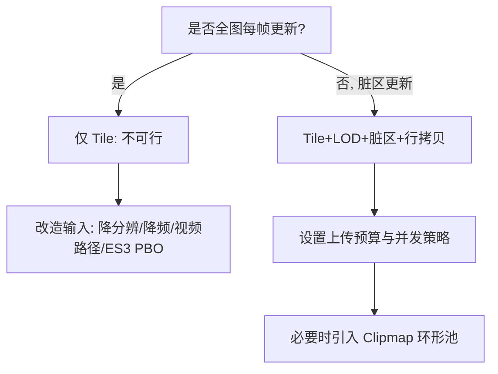

## 高频动态更新场景下的 Tile 方案再评估（20k×20k，10Hz）

### 1. 场景与约束
- **目标场景**：底图尺寸约 20000×20000 像素，内容以约 10 帧/秒频率持续更新；OpenGL ES 2.0；目标设备 Android RK3399/RK3588。
- **现有基础**：已采用 Tile（瓦片）化渲染（参考 `docs/超大纹理渲染_Tile方案.md` 与 `docs/Tile_LOD_方案设计.md`）。
- **核心疑问**：
  - 高频更新下，Tile 方案是否仍适用？
  - “遍历像素，将全图数据按 Tile 写入”的计算/拷贝是否会成为瓶颈？

### 2. 数据量量化（关键结论）
- 若每帧全图更新（最坏情况）：
  - RGBA8：20000×20000×4 ≈ 1.6 GB/帧；10Hz ≈ 16 GB/s 上传/拷贝带宽需求 → 在移动 SoC 与 ES 2.0 管线下基本不可行。
  - 灰度8（LUMINANCE/ALPHA）：≈ 400 MB/帧；10Hz ≈ 4 GB/s → 依然高风险。
- 若每帧仅更新小范围 AABB（脏区总面积 `A` 像素）：
  - 带宽 ≈ `A × bytesPerPixel × 10`（B/s）。当 `A` 远小于全图时，显著可行。

=> **结论 1**：Tile 方案在“全图每帧重写”的条件下不可行；只要更新是“局部/稀疏/增量”的，Tile 方案依然是 ES 2.0 环境下的最优解之一。

### 3. “遍历像素”是否一定昂贵？
- 直接逐像素循环填充每个 Tile 确实会造成高 CPU 开销（cache miss 多、分支多、无向量化）。
- 但可以通过“逐行块拷贝（row-chunk memcpy）+ 子矩形拼接”的方式，将复杂度降低为 O(受影响像素数)，且带来良好缓存局部性与较高内存吞吐。

```mermaid
flowchart TD
    A[输入: 每帧脏区列表 Rect[]] --> B[合并/裁剪脏区]
    B --> C[映射到瓦片网格: 计算覆盖 (tx,ty)]
    C --> D{遍历每个瓦片}
    D --> E[求瓦片内 subRect: 与 TileAABB 求交]
    E --> F[逐行 memcpy 到瓦片像素缓冲]
    F --> G[GL 线程 glTexSubImage2D 上传 subRect]
    G --> H[加入批渲染]
```

实现要点（避免逐像素）：
- 对每个瓦片与脏区做 AABB 求交，得到 `subRect`（通常远小于 Tile 全尺寸）。
- 对 `subRect` 逐行执行 `memcpy`（或 NEON 加速拷贝），一次拷贝连续 N×bytes 的内存块，避免逐像素循环。
- 直接使用 `glTexSubImage2D` 上传 `subRect`，并设置 `GL_UNPACK_ALIGNMENT=1` 减少对齐开销。
- 复用每个瓦片的像素缓冲（direct ByteBuffer / native 指针），避免频繁分配与 GC。
- 多线程：I/O/解码/行块拷贝在线程池并行，GL 线程仅串行处理上传与绘制。

=> **结论 2**：正确的 Tile 子矩形行拷贝策略可避免“逐像素赋值”的 CPU 灰度暴涨问题。

### 4. Tile 方案在该场景下的适配策略
1) **只更新改变区域**：
   - 必须维护脏区（变更 AABB）队列，合并重叠与近邻矩形，显著减少分块数量。
   - 将脏区映射到瓦片集，仅对交叠瓦片进行 `glTexSubImage2D`。
2) **带宽预算与限速**：
   - 每帧设置 GPU 上传上限（例如 8–16 MB/帧，按设备能力调参），超过部分延迟到后续帧，确保渲染帧率稳定。
3) **像素格式降维**：
   - 若源为单通道数据，推荐上传灰度8，片元做 LUT/伽马/伪彩映射，带宽下降 4×。
4) **瓦片尺寸折中（建议 512）**：
   - 512×512 ≈ 1 MB/片（RGBA8）/≈256 KB（GRAY8）；既保证较细的局部更新粒度，又避免过多 draw call。
5) **拷贝与上传优化**：
   - 设置 `GL_UNPACK_ALIGNMENT=1`；合并同纹理连续行段减少多次调用；必要时将多个小 `subRect` 合并为一个较大 `subRect`。
   - JNI/NDK 使用 NEON 优化逐行 memcpy；尽量使用对齐地址和 16/32 字节宽度拷贝。
6) **LOD 与占位兜底**：
   - 低层级 LOD 可更快“看见”全局（低分辨率），高层级逐步补齐，避免卡顿和闪烁。
7) **异步与双缓冲**：
   - 上传期间仍绘制上一帧纹理；瓦片就绪后淡入替换，避免视觉跳变。

### 5. 替代/补充方案对比
- **Virtual Texture/Clipmap（环形缓冲）**：
  - 思路：围绕相机中心维护分层环形纹理缓存，仅更新“移动进入的环形条带”。
  - 优势：对“相机在大图上移动”极其友好，更新量与相机运动相关，而非全图面积。
  - 适配：本质仍是 Tile/LOD 衍生方案；可将现有 TileManager 改造成分层环形池。
- **硬件 mipmap（PoT+padding）**：
  - 生成链条成本高，且 ES 2.0 对 NPOT+mipmap 有限制；高频更新不推荐作为主方案。
- **ES 3.0+ PBO/Vulkan**：
  - PBO 异步上传、持久映射可进一步降低卡顿；但项目约束为 ES 2.0，仅可作为高端机型兜底。
- **压缩纹理（ETC1/ASTC）**：
  - 离线资源可用；高频在线更新通常无法实时压缩，CPU 成本大；仅适合静态层或低频变更层。
- **视频编解码路径（YUV + 硬件解码）**：
  - 若数据来源为视频流，可考虑直接以 YUV 平面进 GPU（外部纹理/双采样转换），大量降低 CPU 拷贝与带宽；但需要业务源配合。
- **片元程序生成/变换**：
  - 若更新是“参数变化而非像素场变化”，可使用片元着色器按参数生成图样，避免大规模上传；取决于业务是否可表达为程序性图形。

### 6. 推荐决策与门槛


门槛建议（经验值，需压测校准）：
- RK3399：建议单帧上传预算 8–16 MB（UI 60fps 时），10Hz 后台可酌情提升；GRAY8 优先。
- RK3588：预算可适当放宽至 16–32 MB/帧。

### 7. 接入步骤（ES 2.0 最小改造）
1) 增加“脏区收集与合并”模块：输入更新 AABB，输出合并后的 Rect 列表。
2) 在 `TileManager` 中新增函数：`List<TileUpdateTask> planUpdates(Rect[] dirtyRects)`，计算 `(tile, subRect)`。
3) 复制策略：针对每个 `(tile, subRect)`，按行 memcpy 到瓦片像素缓冲（NDK/NEON），避免逐像素。
4) 上传策略：GL 线程执行 `glTexSubImage2D(tileTexture, subRect)`；设置 `GL_UNPACK_ALIGNMENT=1`；限制每帧任务量。
5) 渲染：未就绪区域用 LOD/占位兜底；就绪后淡入替换。
6) 监控：埋点上传字节/帧、耗时、命中率、CPU/GPU 时间、帧率与抖动。

### 8. 10 条测试用例（含预期）
1) 小脏区：每帧更新 512×512，期望 ≤2 ms 拷贝（NDK），≤1 ms 上传，60fps 稳定。
2) 多脏区合并：10 个 128×128 相邻矩形，期望合并为 1–2 个较大 AABB，总上传量下降 ≥40%。
3) 大脏区限速：每帧 2048×1024，期望分 2–3 帧完成，UI 帧率保持 ≥55fps。
4) 对齐与边缘：subRect 横跨 Tile 边界，期望无接缝；1px 扩展生效。
5) GRAY8+LUT：源为灰度，shader 伪彩映射一致，带宽与 CPU 明显下降（≥3×）。
6) LOD 兜底：低层优先显示，高层渐进补齐，缩放无闪烁。
7) Clipmap 模式：持续平移，期望仅更新环形条带，上传量与速度成正比。
8) 弱网/慢 I/O：模拟 300ms 读延迟，UI 无卡顿，占位与渐进策略生效。
9) 背景切前台：上下文丢失重建，200ms 内可见区恢复。
10) 极端压力：连续 3 秒大面积更新，系统无 OOM，上传限速策略生效。

### 9. 结论
- **若更新为“全图级、逐帧”**：Tile 在 ES 2.0 下不可行，需从源头降维（分辨率/频率/编码）或平台升级（ES 3.0+PBO/Vulkan/视频路径）。
- **若更新为“局部/增量”**：采用“脏区 → 瓦片子矩形 → 逐行 memcpy → glTexSubImage2D”的策略，Tile 方案完全可行，并能在 RK3399/3588 上达到稳定表现。
- **优先级**：先做 GRAY8+LUT、行拷贝 + 限速；必要时引入 Clipmap 环形池；再考虑平台升级或编码路径。


