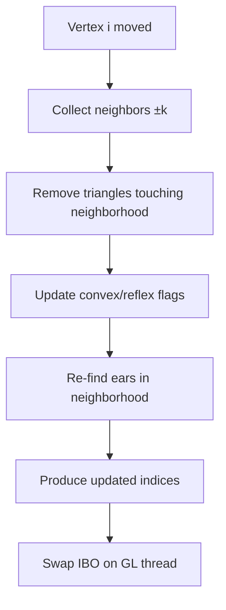
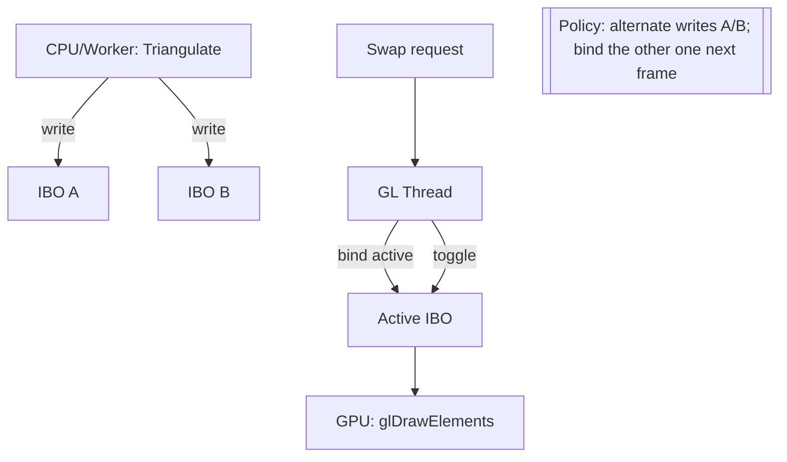
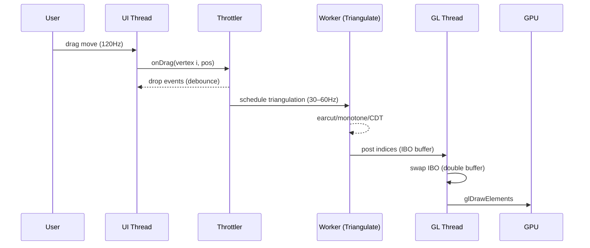

## 背景

OpenGL ES 2.0 只能直接以三角形为基本图元渲染。因此在绘制任意多边形（特别是凹多边形、带洞多边形）前，需要先将其拆分为若干不重叠的三角形，这个过程称为三角化（Triangulation）。本文汇总常见多边形三角化算法、比较优劣，并给出在 OpenGL ES 2.0 中的落地步骤与建议。

---

## 常见三角化算法概览

- **凸多边形扇形分割（Triangle Fan）**
  - 思想：任取一个顶点，将多边形划分为若干扇形三角形。
  - 适用：凸多边形。
  - 复杂度：O(n)。
  - 注意：不适用于凹多边形或带洞多边形。

- **耳切法（Ear Clipping）**
  - 思想：在简单多边形中，找“耳朵三角形”（由相邻三点构成且内部不含其他顶点），剪掉耳朵并迭代，直至剩最后一个三角形。
  - 适用：一般简单多边形，扩展后可支持洞（常搭配环合并或使用成熟实现如 Earcut）。
  - 复杂度：朴素实现 O(n^2)。
  - 优点：实现简单、健壮性好、工业界常用（Mapbox Earcut）。

- **单调多边形三角化（Monotone Triangulation）**
  - 思想：先将多边形分割为关于某条轴单调的子多边形（单调划分），再用线性时间算法对每个单调多边形三角化。
  - 适用：一般简单多边形（需先做单调划分）。
  - 复杂度：划分 O(n log n) 或 O(n)（具体取决于实现），对单调多边形三角化 O(n)。
  - 优点：总复杂度优于朴素耳切，质量稳定；适合较大 n。

- **受约束德劳内三角化（CDT, Constrained Delaunay Triangulation）**
  - 思想：在保证多边形边界与内部约束边不被破坏的前提下，尽量满足德劳内性质，生成质量较好的三角形网格。
  - 适用：一般简单多边形、带孔、带内部约束。
  - 复杂度：常见实现平均 O(n log n)。
  - 优点：三角形质量更好（角度更均衡），适合数值稳定性或后续网格处理要求高的场景；有成熟库（如 poly2tri）。

- **扫描线/扫掠线法（Sweep Line）变体**
  - 思想：使用事件点和状态结构自上而下“扫掠”平面完成划分或三角化，多用于作为单调划分或 CDT 的底层技术。
  - 适用：算法工程实现；更偏底层技术，常作为其他方法的基础。
  - 复杂度：通常 O(n log n)。

---

## 方法对比表（OpenGL ES 2.0 场景）

| 算法 | 适用范围 | 支持洞 | 时间复杂度（典型） | 三角质量 | 实现难度 | 实时拖拽表现（~2k 顶点） | 常用库/备注 |
|---|---|---|---|---|---|---|---|
| 凸多边形扇形分割 | 仅凸多边形 | 否 | O(n) | 一般 | 极低 | 极佳（CPU 占用最低） | 直接实现 |
| 耳切法（Ear Clipping） | 一般简单多边形 | 通过扩展/库支持 | O(n^2) 朴素，工程可近似更快 | 一般 | 低 | 良好（NDK 实现+节流+双缓冲可 30–60Hz） | Earcut（Mapbox） |
| 单调划分 + 单调三角化 | 一般简单多边形 | 需配合洞处理 | 划分 O(n log n)，三角化 O(n) | 稳定 | 中 | 良好（适合大 n） | 常基于扫描线实现 |
| 受约束德劳内（CDT） | 简单多边形/带洞/约束边 | 是 | O(n log n) | 较好（角度均衡） | 中高 | 良好（库实现，质量最佳） | poly2tri 等 |
| 扫掠线法（变体/基础技术） | 作为划分/三角化底层 | 取决于上层 | 通常 O(n log n) | 取决于上层 | 中高 | 取决于上层 | 常用于单调划分/CDT |

说明：实时拖拽下，若多边形频繁改变形状，优先考虑“快速凸性判定 + 扇形分割”快路径；否则采用高性能耳切或 CDT，并结合后台计算 + IBO 双缓冲与帧率节流。

---

## 耳切法流程（示意）

```mermaid
flowchart TD
    start([Start]) --> orient[Compute polygon orientation]
    orient -->|CW| reverse[Reverse to CCW]
    orient -->|CCW| loop[Initialize ear clipping loop]
    reverse --> loop
    loop --> checkN{n > 3?}
    checkN -->|Yes| findEar[Find next ear candidate]
    findEar --> convex{Vertex i is convex?}
    convex -->|Yes| emptyTest{Triangle (i-1,i,i+1) contains any other vertex?}
    convex -->|No| next[Next vertex]
    emptyTest -->|No| output[Output triangle (i-1,i,i+1)]
    emptyTest -->|Yes| next
    output --> remove[Remove vertex i]
    remove --> checkN
    next --> findEar
    checkN -->|No| last[Output last triangle]
    last --> end([End])
```

实现要点：
- 顶点序需要统一为 CCW（或 CW），保持一致可避免“凸性”判断混乱。
- 凸性判断可通过叉乘符号实现；空三角形测试需考虑共线与数值误差（建议使用容差 epsilon）。
- 对带洞输入，可使用外环+内环合并（桥连）或直接采用支持洞的实现（如 Earcut）。

---

## 算法选择建议（决策示意）

```mermaid
flowchart TD
    A[Need to triangulate polygon] --> B{Holes present?}
    B -->|Yes| C[Use Earcut or CDT]
    B -->|No| D{Triangle quality important?}
    C --> E{Large N or frequent updates?}
    E -->|Large/frequent| F[CDT (e.g., poly2tri)]
    E -->|Small/occasional| G[Earcut]
    D -->|Yes| F
    D -->|No| H{Polygon monotone?}
    H -->|Yes| I[Monotone triangulation O(n)]
    H -->|No| J[Ear clipping O(n^2) or partition then monotone]
    I --> K[Build index buffer -> GL_TRIANGLES]
    G --> K
    F --> K
    J --> K
```

---

## 各方法优劣对比

- **凸多边形扇形分割**
  - 优点：实现最简单、速度快。
  - 缺点：仅限凸多边形；不支持洞。

- **耳切法**
  - 优点：实现简单，工业界使用广泛，有高质量实现（Earcut）；可支持凹多边形和洞；鲁棒性好。
  - 缺点：朴素复杂度 O(n^2)；极端退化形状需要容差处理。

- **单调划分 + 单调三角化**
  - 优点：整体复杂度较低，适合大规模顶点；实现后性能稳定。
  - 缺点：实现复杂度高于耳切；需要先做划分。

- **CDT（受约束德劳内）**
  - 优点：生成质量更好的三角形（角度更均衡），适合需要数值稳定性的渲染与后处理；支持洞和内部约束。
  - 缺点：实现复杂度较高；一般需要第三方库；性能通常为 O(n log n)。

---

## 算法原理详解

### 凸多边形扇形分割（Triangle Fan）
- 原理：选择一个锚点（常用顶点 0），对 i=1..n-2 形成三角形 (0,i,i+1)。
- 正确性：凸多边形任意对角线均在多边形内部，扇形分割不会与边界冲突。
- 复杂度：O(n)。
- 细节：
  - 仅适用于凸多边形；
  - 可配合快速凸性检测（扫描所有相邻三元组叉乘符号一致）。

### 耳切法（Ear Clipping）
- 原理：
  1) 统一顶点序为 CCW；
  2) 遍历顶点，找“凸顶点” b，组成候选三角 (a=b-1, b, c=b+1)；
  3) 若三角形内部不包含其他任何顶点，则为“耳朵”，输出该三角并移除顶点 b；
  4) 重复直至剩 3 个顶点。
- 判定要点：
  - 凸性：cross(a->b, b->c) 与整体朝向一致；
  - 点内测试：Point-In-Triangle（建议含 epsilon 容差，处理共线/数值误差）；
  - 洞：可通过环连接（桥接）或采用 Earcut 这类直接支持多环的实现。
- 复杂度：
  - 朴素实现 O(n^2)（每次找耳朵 O(n)，共 O(n) 次）；
  - 工程优化：维护“候选耳集合”、仅在局部更新；点内测试可用 AABB 预过滤或网格桶加速。
- 交互增量：
  - 顶点拖拽时，仅撤销与该顶点邻域相关的三角，再在邻域内重耳切；通常 k≪n，近似 O(k)。

### 单调多边形三角化（Monotone Triangulation）
- 原理：
  1) 选择轴（常用 y 轴），通过扫描线将多边形分割成“关于 y 单调”的子多边形；
  2) 对每个单调多边形，使用栈线性时间三角化：按 y 从高到低排序顶点，维护左右链关系，遇到“同链/异链”顶点采用不同出栈规则生成三角；
  3) 合并所有子结果。
- 复杂度：
  - 划分 O(n log n)（或更优工程实现）；
  - 单调三角化 O(n)。
- 适用：较大规模简单多边形，对实时性有要求且不使用外部库时的高性价比方案。

### 受约束德劳内三角化（CDT）
- 原理：在保证边界与内部约束边存在的条件下，追求“尽可能德劳内”的三角剖分；常见做法：
  - 从朴素三角剖分出发进行边翻转以满足德劳内准则；或
  - Bowyer–Watson 增量插点构造，再强制嵌入约束边并本地修复；
  - 对带洞/多环自然支持。
- 优点：
  - 三角质量较高（避免细长三角形），数值稳定性好，适合集成纹理/采样或物理后处理；
  - 对复杂输入（带洞、约束）鲁棒。
- 复杂度：平均 O(n log n)。
- 实践：推荐使用成熟库（如 poly2tri）。

### 扫掠线法（Sweep Line）
- 定位：更多作为“单调划分/CDT”的底层技术框架；
- 思想：维护事件点集合与活动边结构，自顶向下（或自左向右）扫描平面；
- 作用：
  - 快速完成单调划分；
  - 在 CDT 中用于事件驱动的结构更新与冲突检测。

---

## 示例图（Mermaid）

### 凸/凹顶点判定（统一为 CCW）

```mermaid
flowchart TD
    start([Start]) --> ori[Ensure CCW orientation]
    ori --> loop[For each vertex i]
    loop --> cross[Compute z = cross(b-a, c-b).z]
    cross --> check{z >= 0?}
    check -->|Yes| convex[Mark convex]
    check -->|No| reflex[Mark reflex]
    convex --> next[Next i]
    reflex --> next
    next -->|More| loop
    next -->|Done| end([End])
```

### 点是否在三角形内（重心/重 barycentric 法）

```mermaid
flowchart TD
    A[Point p and triangle (a,b,c)] --> V[Compute v0=c-a, v1=b-a, v2=p-a]
    V --> D[dot00=v0·v0, dot01=v0·v1, dot02=v0·v2, dot11=v1·v1, dot12=v1·v2]
    D --> I[invDenom = 1/(dot00*dot11 - dot01*dot01)]
    I --> UV[u=(dot11*dot02 - dot01*dot12)*I, v=(dot00*dot12 - dot01*dot02)*I]
    UV --> T{u>=0 and v>=0 and u+v<=1?}
    T -->|Yes| inside[Inside]
    T -->|No| outside[Outside]
```

### 增量耳切：邻域局部更新



---

### 耳朵判定（含 AABB 预过滤）

```mermaid
flowchart TD
    IN[Candidate ear (a,b,c), vertices V] --> AABB[Compute triangle AABB]
    AABB --> FILT[Filter S = { p in V \, p∉{a,b,c} \, p in AABB }]
    FILT --> TEST{Exists p ∈ S s.t. p in Triangle(a,b,c)?}
    TEST -->|Yes| REJ[Not an ear]
    TEST -->|No| ACC[Accept ear (a,b,c)]
```

### 单调划分（扫描线事件简化示意）

```mermaid
flowchart TD
    P[Polygon edges] --> Q[Build event queue (sorted by y)]
    Q --> LOOP[Process next event]
    LOOP --> TYPE{Classify vertex type}
    TYPE --> START[Start: add edge, set helper=start]
    TYPE --> END[End: if helper is merge -> add diagonal; remove edge]
    TYPE --> SPLIT[Split: find left edge; add diagonal to helper; update]
    TYPE --> MERGE[Merge: if helper is merge -> add diagonal; find left edge -> add diagonal; update]
    TYPE --> REG[Regular: update edges/helpers by left/right chain]
    START --> NEXT[Next event]
    END --> NEXT
    SPLIT --> NEXT
    MERGE --> NEXT
    REG --> NEXT
    NEXT -->|More| LOOP
    NEXT -->|Done| OUT[Monotone pieces]
```

---

### 索引双缓冲（IBO Double Buffering）



### 拖拽节流时序（30–60Hz）



### VBO/IBO 更新数据流

```mermaid
flowchart TD
    Drag[Drag vertex] --> UpdateV[Update vertex array (VBO data)]
    UpdateV --> Route{Convex?}
    Route -->|Yes| Fan[Triangle Fan indices]
    Route -->|No| Tri[Triangulate (earcut/CDT)]
    Fan --> UploadI[Upload/Swap IBO]
    Tri --> UploadI
    UpdateV --> UploadV[glBufferSubData(VBO)]
    UploadI --> Draw[glDrawElements(GL_TRIANGLES)]
```

### 网格桶加速点内测试（用于耳朵判定）

```mermaid
flowchart TD
    Build[Build uniform grid buckets for vertices] --> Candidate[Candidate ear (a,b,c)]
    Candidate --> AABB[Triangle AABB -> query buckets]
    AABB --> Points[Enumerate points in overlapping buckets]
    Points --> Test{Any point inside triangle?}
    Test -->|Yes| Reject[Not an ear]
    Test -->|No| Accept[Accept ear]
```

---

### 耳切增量更新：邻域选择策略对比（不同 k 的影响）

```mermaid
flowchart TD
    K[Choose neighborhood size k] --> S{Select k size}
    S -->|Small (k≈4–6)| KS
    S -->|Medium (k≈8–16)| KM
    S -->|Large (k≥24)| KL
    KS --> C1[CPU cost: Low]
    KS --> Q1[Mesh stability: May flicker near edits]
    KS --> L1[Latency: Minimal]
    KM --> C2[CPU cost: Moderate]
    KM --> Q2[Stability: Good, fewer re-triangulation artifacts]
    KM --> L2[Latency: Low]
    KL --> C3[CPU cost: Higher]
    KL --> Q3[Stability: Best, near-global smoothing]
    KL --> L3[Latency: May increase under sustained drag]
    Note[[Heuristic: k ≈ 8–16 for n≤2k; adjust by device budget and drag speed]]
```

---

### CDT 边翻转局部修复（Local Edge Flip）

```mermaid
flowchart TD
    P[Adjacent triangles share edge e=(a,c): (a,b,c) and (a,c,d)] --> IC{Violates Delaunay?\nInCircle(b,△a,c,d) or InCircle(d,△a,b,c)}
    IC -->|Yes| FLIP[Flip edge: (a,c) → (b,d)]
    IC -->|No| KEEP[Keep edge]
    FLIP --> UPD[Update adjacency; push neighbors to queue]
    KEEP --> NEXT[Process next pair]
    UPD --> NEXT
    NEXT --> END([End])
```

### 凸性快速检测（真值关系）

```mermaid
flowchart TD
    ORI[Polygon orientation known?] --> CCW[Case: CCW]
    ORI --> CW[Case: CW]
    CCW --> Z1{z = cross(prev->cur, cur->next) >= 0?}
    Z1 -->|Yes| C1[Convex]
    Z1 -->|No| R1[Reflex]
    CW --> Z2{z = cross(prev->cur, cur->next) <= 0?}
    Z2 -->|Yes| C2[Convex]
    Z2 -->|No| R2[Reflex]
    note[[Use epsilon near zero to handle collinearity]]
```

---

## OpenGL ES 2.0 落地步骤

1. **准备输入**：
   - 顶点列表 `P = [p0, p1, ..., p(n-1)]`（建议 CCW）。
   - 若存在洞：提供外环与内环（每个环独立 CCW/CW，按库需求）。

2. **选择算法**：
   - 简单凹多边形、实时性中等：优先选择耳切（Earcut）。
   - 需要更好三角质量或大规模数据：CDT（如 poly2tri）。
   - 输入本身单调或可快速划分：单调三角化。

3. **执行三角化**：
   - 输出索引数组 `I = [i0, i1, i2, i3, i4, i5, ...]`，每 3 个为一个三角形。

4. **构建 GPU 缓冲**：
   - 顶点缓冲（VBO）：存储位置、可选纹理坐标、颜色等。
   - 索引缓冲（IBO/EBO）：存储 `I`，以 `GL_TRIANGLES` 绘制。

5. **渲染**：
   - 绑定着色器、设置统一变量（矩阵/颜色/纹理）。
   - 调用 `glDrawElements(GL_TRIANGLES, indexCount, GL_UNSIGNED_SHORT/INT, 0)`。

6. **数值与健壮性**：
   - 处理重复点、共线点、非常小的边；预归一化或坐标缩放以减小误差。
   - 对非简单多边形（自交）需先修正或拒绝处理。

---

## 极简伪代码（耳切法）

```text
function triangulateEarClipping(vertices):
  V = ensureCCW(vertices)
  T = []
  while |V| > 3:
    found = false
    for i in 0..|V|-1:
      a = V[i-1], b = V[i], c = V[i+1]
      if isConvex(a,b,c) and noOtherPointInsideTriangle(a,b,c,V):
        T.append((a,b,c))
        V.remove(b)
        found = true
        break
    if not found:
      fail("degenerate or non-simple polygon")
  T.append((V[0],V[1],V[2]))
  return T
```

---

## 10 条用例与预期结果

为便于对比，以下“预期结果”不绑定具体三角索引顺序，而以“是否可三角化、三角形个数、算法建议”来表述。

1. **凸四边形（矩形）**：无洞
   - 期望：可三角化，三角形数 = 2。
   - 建议算法：扇形分割/耳切/单调均可（任选其一）。

2. **凹五边形（箭头形）**：无洞
   - 期望：可三角化，三角形数 = 3。
   - 建议算法：耳切 或 单调划分+三角化。

3. **星形凹多边形（简单不自交）**：无洞
   - 期望：可三角化，三角形数 = n-2（例如 8 边则 6 个）。
   - 建议算法：耳切（注意容差）；复杂场景可用 CDT。

4. **带一个孔的环形多边形（甜甜圈边界）**
   - 期望：可三角化，三角形数 = 外环顶点数 + 内环顶点数 - 2。
   - 建议算法：Earcut（原生支持洞）或 CDT。

5. **包含大量共线点的多边形**
   - 期望：可三角化；可能需要去重或容差；三角形数 = n-2（若去除冗余点后）。
   - 建议算法：耳切（带 epsilon），或 CDT（更稳）。

6. **重复顶点（p[i] == p[i+1]）**
   - 期望：预处理去重后可三角化；三角形数 = 去重后 n-2。
   - 建议算法：任意，但务必先预处理。

7. **自交多边形（蝴蝶结）**
   - 期望：不应直接三角化；需先修正为简单多边形或分解为多个简单区域。
   - 建议算法：先几何修复，再 CDT/耳切。

8. **大规模简单多边形（n ≥ 5000）**
   - 期望：可三角化；性能敏感。
   - 建议算法：单调划分+三角化 或 CDT；少用朴素 O(n^2) 耳切。

9. **Y-单调多边形**
   - 期望：可三角化，线性时间；三角形数 = n-2。
   - 建议算法：单调三角化（O(n)）。

10. **带多孔（≥2 个孔）的复杂多边形**
   - 期望：可三角化；三角形数 = 外环与所有内环顶点总数 - 2。
   - 建议算法：CDT 或 Earcut（洞多时建议 CDT 以提升质量）。

---

## 实践建议（OpenGL ES 2.0）

- 顶点序保持一致（CCW/CW）并在片元着色器中配合面剔除（若使用）。
- 使用 16 位索引在移动端更省内存；顶点数超过 65535 时拆批或使用 32 位索引（注意设备支持）。
- 对带纹理的多边形，三角化前先为每个顶点计算好纹理坐标，三角索引直接复用。
- 若运行时频繁更新多边形，可缓存三角化结果并按需增量更新。
- 生产中优先选用成熟库实现（例如 Earcut、poly2tri）以保证鲁棒性与性能。

---

## 项目场景推荐方案（无洞，0~2000+ 顶点，拖拽实时）

场景特征：无洞、顶点最多约 2k、拖拽时需要边拖边渲染、不可卡顿。

- **首选方案（简单稳妥）**：
  - 快路径：实时检测是否凸多边形，若凸则使用扇形分割 O(n)。
  - 否则：使用高性能 Earcut 实现（建议 NDK 引入 C++ 版本，如 `mapbox/earcut.hpp`），每次拖拽更新时整多边形重三角化；将三角化放在后台线程，结果在 GL 线程更新 IBO（双缓冲索引）。2k 顶点在现代机型上可达到 60 FPS。
  - 限流与降级：
    - 拖拽中以 30–60Hz 对多边形重三角化（节流）；
    - 若帧内预算不足，复用上一帧索引，仅更新顶点坐标（可保持画面连续）。

- **进阶优化（更低抖动/更高帧率）**：
  - 局部增量耳切：只在“被拖拽顶点及其邻域（例如各自 ±8 顶点）”范围内撤销并重新耳切，时间复杂度近似 O(k)，k 远小于 n。
  - 空三角检测加速：
    - 仅对“凹顶点集合”做点内测试；
    - 结合 AABB 预过滤；
    - 可选用均匀网格/简单网格桶以减少点内测试耗时。

- **线程与缓冲区策略**：
  - 背景线程：计算三角索引与可选法线/UV；
  - GL 线程：仅执行 VBO 顶点更新（位置变化）与 IBO 交换；
  - 双缓冲 IBO：`indicesA/indicesB` 交替写入与绑定，避免与渲染争用；
  - 复用数组，避免频繁分配产生 GC 抖动。

```mermaid
flowchart TD
    S[拖拽事件(vertex i moved)] --> C{快速凸性判定?}
    C -->|是| FAN[Triangle Fan O(n)]
    C -->|否| L{启用增量耳切?}
    L -->|是| Local[局部撤销并重耳切(邻域±k)]
    L -->|否| Full[Earcut 全量重三角化]
    Local --> BG[后台线程计算索引]
    Full --> BG
    FAN --> GL[GL 线程更新 VBO/IBO]
    BG --> Swap[双缓冲 IBO 交换]
    Swap --> GL
```

实现要点（伪代码轮廓）：

```text
onDrag(vertexIndex, newPos):
  updateVertex(vertexIndex, newPos)
  if isConvex(polygon):
    indices = triangulateFan(polygon)
    uploadOnGLThread(vertices, indices)
    return
  if useIncremental:
    neighborhood = collectNeighbors(vertexIndex, k=8)
    retractTrianglesTouching(neighborhood)
    reclipEars(neighborhood)
    uploadOnGLThread(vertices, indices)
  else:
    runInBackground(() => {
      indicesNew = earcut(polygon)
      postToGlThread(() => swapIndexBuffer(indicesNew))
    })
```

预期性能：
- 凸多边形路径 O(n)，2k 顶点可轻松 60 FPS；
- 增量耳切路径近似 O(k)，k≪n，拖拽平滑；
- 全量 Earcut（NDK）在 2k 顶点下通常可达 30–60Hz，结合节流/双缓冲可确保不卡顿。

---

## 小结

- 在 OpenGL ES 2.0 中，多边形渲染需要先三角化。
- **耳切法**：实现简单、适用面广，是实时渲染的常用选择；
- **单调三角化**：适合大规模顶点的高性能场景；
- **CDT**：在质量与鲁棒性要求更高时优先；
- 按本文“算法选择图”结合数据规模、是否带洞、质量需求进行取舍即可。


