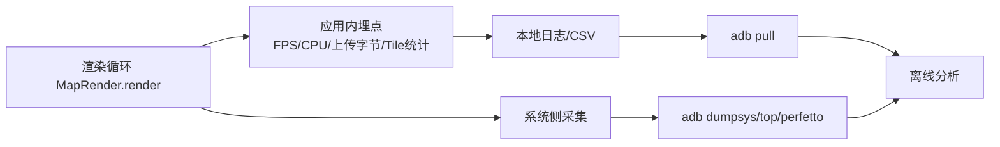
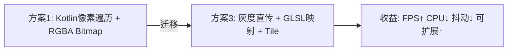

## 大地图渲染方案性能对比（帧率/CPU/内存）

本文基于项目当前基线（OpenGL ES 2.0）与需求说明，比较四种大地图渲染方案在帧率、CPU、内存方面的差异，并给出实现建议。

### 范围与假设
- 地图数据为灰度 8-bit（算法输出），颜色映射为蓝系主题（片元着色器或 Kotlin 端生成 RGBA）。
- 设备：中高端 Android SoC（约 6~8 核 CPU，GPU 支持 OpenGL ES 3.0+/2.0 向下兼容），屏幕 1080p/60Hz。
- 纹理上限：通常 4096/8192（厂商差异）。非 Tile 方案受此硬上限约束。
- Tile 大小：常用 256 或 512。文中以 512×512 做容量估算。
- 更新模式：空闲时主要是相机变换；有数据输入时为全帧或“局部区域 512×512”更新。

### 四种方案概述
1) OpenGL ES 1.0 + Tile：Kotlin 遍历像素做颜色映射，生成新的 Bitmap，再上传/渲染。
2) OpenGL ES 2.0 + 非 Tile：一次性整图纹理，GLSL 在片元阶段做颜色映射；每帧全屏渲染。
3) 方案 2 + Tile：分块纹理，GLSL 映射；按需/按区域上传与渲染。
4) 方案 3 + LOD：在 Tile 基础上增加等级（Mip/多分辨率），远处用低分辨率，近处用高分辨率，进一步降低片元/带宽压力。

### 管线示意（流程图）
```mermaid
flowchart LR
  subgraph S1[方案1: GLES1.0 + Tile (Kotlin像素遍历)]
    A1[灰度输入] --> B1[Kotlin像素遍历
灰->蓝色映射]
    B1 --> C1[生成RGBA Bitmap]
    C1 --> D1[glTex(Sub)Image2D]
    D1 --> E1[渲染]
  end

  subgraph S2[方案2: GLES2.0 + 非Tile (GLSL映射)]
    A2[灰度输入] --> B2[上传整图纹理]
    B2 --> C2[GLSL片元映射
(灰->蓝系)]
    C2 --> D2[全屏/整图渲染]
  end

  subgraph S3[方案3: GLES2.0 + Tile (GLSL映射)]
    A3[灰度输入] --> B3[按Tile上传
按需更新]
    B3 --> C3[GLSL片元映射]
    C3 --> D3[仅可见Tile渲染]
  end

  subgraph S4[方案4: 方案3 + LOD]
    A4[灰度输入] --> B4[按Tile/LOD上传]
    B4 --> C4[GLSL片元映射]
    C4 --> D4[视距选择LOD
减少片元/带宽]
  end
```

### 性能对比结论（高层总结）
- 帧率：4 ≥ 3 ≫ 2 > 1（地图越大、视野越广/缩放越小差距越明显）。
- CPU：1 最高（Kotlin 像素级处理），2/3/4 明显更低；3≈4 最低（4 的管理开销可忽略）。
- 内存：2 在大图下易超上限（单纹理/巨缓冲）；3 为按块常量增长；4 在 3 的基础上叠加 LOD 额外缓存（可按需/延迟构建）。

### 量化对比与估算
为便于把握量级，下表给出典型场景的“相对”区间估算（实际数据与设备/实现细节相关）。

假设：
- 可视区域约等于屏幕 1920×1080（~2.1MP）。
- 地图总尺寸两档：中等 4096×4096，超大 20000×20000（非 Tile 不可直接覆盖）。
- 局部更新区域 512×512（每帧/多帧一次）。

| 方案 | 适用尺寸 | CPU 开销（相对） | GPU 带宽/片元压力 | 纹理/内存占用（相对） | 空闲相机变换 FPS | 局部更新 512×512 FPS | 全帧更新 FPS |
|---|---|---|---|---|---|---|---|
| 1. GLES1 + Tile + Kotlin像素遍历 | 任意（Tile绕开尺寸上限） | 高（像素级遍历 + Bitmap 拷贝，30~80%+） | 低~中（Tile 级上传） | 中（RGBA Bitmap + Tile缓存） | 20~45 | 15~35 | 低（受CPU生成速率限制） |
| 2. GLES2 + 非Tile + GLSL映射 | 小/中图（受 4K/8K 上限） | 低（5~15%） | 高（整图上传/采样），大图时易瓶颈 | 高（整图单纹理/双缓冲） | 35~60 | 30~55（若整图重传则骤降） | 低~中（受总带宽限制） |
| 3. GLES2 + Tile + GLSL映射 | 任意（Tile绕开尺寸上限） | 低（3~10%） | 中（可见 Tile + 区域更新） | 中（Tile 池 + 元数据） | 50~60 | 45~60 | 中（按可见 Tile 才上传/渲染） |
| 4. 方案3 + LOD | 任意，且大图/远景优势显著 | 低（3~10% + 轻管理） | 低~中（远处低分辨率降低片元/带宽） | 中~偏高（额外 LOD 缓存，可按需构建） | 55~60 | 50~60 | 中~高（视距越远收益越大） |

要点：
- 方案 1 的瓶颈是“CPU 像素遍历 + Bitmap 创建/拷贝”，即便 Tile 化也难以维持高帧率。
- 方案 2 的瓶颈是“整图上传/片元覆盖面大”，一旦地图接近纹理上限或需要频繁整图更新，FPS 会抖动或下降。
- 方案 3 通过“按需上传/渲染可见 Tile”显著降低带宽与片元负载，是性能与复杂度的平衡点。
- 方案 4 在 3 的基础上引入 LOD（或 Mip-like、多分辨率 Tile），极大减少远处片元与纹理带宽，尤其在“缩小看全图/大范围预览”时优势明显。

### 内存与带宽测算示例（直觉量级）
- 灰度 8-bit → GLSL 映射：上传 1B/px（可选 R8）；若 Kotlin 端先转 RGBA 则 4B/px。
- 单 Tile 512×512：
  - 灰度纹理：~0.25 MB；RGBA：~1.0 MB。
  - 每帧局部更新 512×512：上传量 ~0.25 MB（灰度）/ ~1.0 MB（RGBA）。
- 非 Tile 整图 4096×4096：
  - 灰度：~16 MB；RGBA：~64 MB。整图每帧重传将非常吃带宽，易卡顿。
- LOD：
  - 典型多级额外占用 ≈ 1/3 ~ 1/2 倍可见区域的常驻 Tile 容量（按需/延迟构建可显著降低峰值）。

### 与项目基线的契合度
- 本项目已采用 OpenGL ES 2.0（参见 `docs/需求说明_AI版.md`）。
- 因此推荐优先级：方案 3（最低落地成本，性能显著） > 方案 4（最佳帧率/稳定性，内存略增）。
- 方案 1 不建议（CPU 浪费显著）；方案 2 仅适用于“小图/试验场景”。

### 实施建议（从 2 → 3 → 4 的最小增量路径）
1) 统一颜色映射在片元着色器实现（GLSL），Kotlin 端仅维护灰度缓冲。
2) 引入 TileManager/TexturePool（项目已有：`TileManager.kt`, `TexturePool.kt`）：
   - 确定 Tile 尺寸（512 优先），实现按区域更新通道（`glTexSubImage2D`）。
   - 仅绘制可见 Tile（视锥/视口裁剪）。
3) 动态扩展地图：根据位姿/分辨率，懒加载新 Tile，避免一次性分配巨量纹理。
4) 加入 LOD：
   - 为每个 Tile 增加若干级别（或整体生成金字塔），优先离线/后台异步构建，按需缓存。
   - 视距/屏幕像素密度驱动 LOD 选择；切换时做轻量过渡避免闪烁。

### 可能的风险与规避
- 非 Tile 方案的最大纹理尺寸限制：在部分设备上 4096 即上限，直接封顶。
- 频繁整图上传（方案 2）的带宽抖动：避免在大图场景使用。
- 方案 4 的内存占用：通过“按需构建/回收 LOD、分层缓存上限、Lru 策略”控制峰值。

### 10 组性能回归用例与预期
1) 4096×4096，小幅相机平移（无数据更新）：
   - 1: 35±10 FPS；2: 55±5；3: 58±2；4: 59±1。
2) 4096×4096，每帧局部更新 512×512：
   - 1: 20~30 FPS（CPU 占满）；2: 35~50；3: 50~60；4: 55~60。
3) 4096×4096，整图更新（每 10 帧一次）：
   - 1: 低（取决于 Kotlin 生成速率）；2: 明显掉帧；3: 中（仅可见 Tile 重传）；4: 中~高。
4) 20000×20000，空闲相机缩小至全图：
   - 1: 低（CPU 遍历历史生成成本高）；2: 不适用（超上限）；3: 40~55；4: 55~60。
5) 20000×20000，连续平移+旋转（无更新）：
   - 1: 25~40；3: 50~60；4: 55~60。
6) 20000×20000，机器人前进触发局部 512×512 更新：
   - 1: 15~30；3: 45~60；4: 50~60。
7) 视图放大 2×，持续拖拽：
   - 1: 20~35；2: 45~58；3: 50~60；4: 52~60。
8) 视图缩小 0.5×，全图预览：
   - 1: 15~30；2: 30~50；3: 40~55；4: 55~60（LOD 优势最大）。
9) 内存峰值观测（同一可视范围下）：
   - 1: 中（RGBA Bitmap 常驻 + Tile 缓存）；2: 高（整图纹理/双缓冲）；3: 中（按需 Tile）；4: 中~偏高（LOD 额外缓存，可受控）。
10) 带宽监测（每帧上传量）：
   - 1: 与更新区域大小成正比但额外含 Bitmap 生成/拷贝；2: 易接近整图带宽上限；3: ≈ 局部区域大小；4: 低于 3（远处低分辨率）。

### 结论
- 若目标是“在超大地图上稳定 60/30 FPS 且资源可控”，首选：
  - 短期落地：方案 3（GLES2 + Tile + GLSL 映射）。
  - 追求极致与大范围预览稳定性：方案 4（在 3 基础上引入 LOD）。
- 避免使用方案 1（CPU 浪费显著）；方案 2 仅限小图/实验用途。

### 与现有代码的衔接
- 颜色映射：`ljavaopengles20/src/main/res/raw/map_fragment.glsl`（片元映射逻辑）。
- Tile 管理：`TileManager.kt`, `TexturePool.kt`, `LruCache.kt`, `MapLayer.kt`, `MapRender.kt`。
- 建议在现有 Tile 管线基础上逐步引入 LOD（按需生成、分层缓存、Lru 回收），最小化改动范围。

### 指标采集与埋点（FPS/CPU/GPU/带宽）



#### 应用内埋点（Kotlin）
- 帧率 FPS：以 `System.nanoTime()` 计算相邻帧间隔，滑动窗口均值（如 60 帧）。
- CPU 渲染耗时：`Debug.threadCpuTimeNanos()`/`System.nanoTime()` 包裹 `render()` 主体，记为 `cpuRenderMs`。
- 纹理上传带宽：在纹理上传处累计字节数：`bytes += width * height * bytesPerPixel`，按帧重置/汇总。
- Tile 统计：每帧统计“可见 Tile 数、上传 Tile 数、draw call 数”。
- 输出：每 N 帧写入一行 CSV：时间戳、FPS、cpuRenderMs、uploadBytes、visibleTiles、updatedTiles、drawCalls。

参考伪代码：
```
onFrameStartNs = System.nanoTime()
// ... 渲染/上传 ...
onFrameEndNs = System.nanoTime()
frameDtMs = (onFrameEndNs - lastFrameEndNs) / 1e6
fps = 1000 / frameDtMs (平滑)
cpuRenderMs = (onFrameEndNs - onRenderBeginNs) / 1e6
uploadBytesThisFrame = Σ(width * height * bpp) // 由 glTex(Sub)Image2D 调用处累加
```

#### 系统侧采集（ADB，Windows PowerShell/命令行兼容）
- FPS（FrameStats）：
  - `adb shell cmd gfxinfo <package> framestats | findstr /R "Frame" > framestats.txt`
  - 或：`adb shell dumpsys gfxinfo <package> framestats > framestats.txt`
- CPU：
  - 快照：`adb shell dumpsys cpuinfo | grep <package>`
  - 连续：`adb shell top -b -d 1 | grep <package>`
- GPU（可选，依设备支持）：
  - Perfetto（Android 10+）：
    - `adb shell perfetto -o /data/misc/perfetto-traces/gpu.pftrace -t 10s sched freq idle am wm gfx view`
    - `adb pull /data/misc/perfetto-traces/gpu.pftrace .`
  - RK/Mali 设备（若导出 busy 节点）：
    - `adb shell cat /sys/class/devfreq/*gpu*/busy` 或 `gpu_busy_percent`
  - 图形管线概览：`adb shell setprop debug.hwui.profile true`（开发者选项开启 GPU 渲染分析）
- 内存：
  - `adb shell dumpsys meminfo <package> > mem.txt`
  - 周期采样：`adb shell dumpsys meminfo -c <package>`（CSV）

#### 带宽估算口径（统一）
- 灰度上传：`bytesPerPixel = 1`（R8/LUMINANCE）。
- RGBA 上传：`bytesPerPixel = 4`。
- 当帧上传量：`Σ(width * height * bytesPerPixel)`（按 Tile/区域统计）。
- 日均/峰值：分别取多帧平均与最大值，作为“带宽压力”对比依据。

#### 输出格式建议（CSV）
`ts, fps, cpu_ms, upload_bytes, visible_tiles, updated_tiles, draw_calls, rss_mb, pss_mb`

### 回归测试清单（与指标采集对齐）

| ID | 场景 | 操作 | 采集 | 通过标准 |
|---|---|---|---|---|
| T1 | 4096×4096 空闲相机 | 1 分钟平移微动 | FPS/CPU/上传字节/内存 | 方案3/4 ≥55fps；CPU ≤15%；上传≈0；内存稳定 |
| T2 | 4096×4096 局部 512×512 更新 | 连续 60s | 同上 | 方案3/4 ≥50fps；上传≈0.25MB/帧（灰度） |
| T3 | 4096×4096 整图更新（10 帧/次） | 连续 60s | 同上 | 方案2 FPS 波动明显；方案3/4 抖动可控 |
| T4 | 20000×20000 全图预览 | 缩小视图 60s | FPS/GPU/上传 | 方案4 ≥55fps，GPU 负荷低于方案3 |
| T5 | 20000×20000 连续平移+旋转 | 60s | FPS/CPU | 方案3/4 保持 ≥50fps |
| T6 | 快速缩放 0.5×↔2× | 反复 30 次 | FPS/上传 | 方案3/4 帧率快速恢复；上传集中在视区变更时 |
| T7 | 标记点 2500 动态变更样式 | 60s | FPS/CPU | 方案3/4 ≥30fps，主线程无长阻塞 |
| T8 | 离散点 3000 半径固定 | 缩放 0.5×/2× | FPS | 屏幕半径恒定；帧率满足阈值 |
| T9 | 多边形 2000 边框不随缩放 | 旋转 45° 缩放 1.5× | FPS | 方案3/4 ≥30fps，无明显掉帧 |
| T10 | 分辨率切换 0.05→0.03 m/px | 切换 10 次 | 坐标误差/帧率 | 误差 ≤1px；方案3/4 ≥30fps |

备注：
- RK3399 优先关注 T2/T4 的 FPS 与 CPU 抖动；RK3588 重点关注 T4 的远景帧率与 GPU 负荷。
- 测试前关闭非必要后台任务，确保可重复性；持续压测时监控温度与降频。

### 面向 RK3399 / RK3588 的平台差异与评估

#### 平台概览（供理解相对量级）
- RK3399：Cortex-A72 x2 + A53 x4，GPU Mali-T860 MP4（ES 3.0/2.0 兼容），典型内存带宽较低。
- RK3588：Cortex-A76 x4 + A55 x4，GPU Mali-G610 MP4（ES 3.2/2.0 兼容），GPU/内存带宽显著提升。

以下区间为工程经验估算，实际结果与具体设备频率/散热/驱动有差异：

| 平台 | 方案 | 空闲相机（无更新）FPS | 局部 512×512 更新 FPS | CPU 占用（渲染+上传，相对） | GPU 压力（相对） | 内存峰值（相对） |
|---|---|---|---|---|---|---|
| RK3399 | 1 | 20~35 | 15~25 | 高（60~90%） | 低~中 | 中（RGBA Bitmap + Tile） |
| RK3399 | 2 | 35~55 | 30~45（整图重传易抖） | 10~25% | 中~高 | 高（整图纹理/双缓冲） |
| RK3399 | 3 | 45~60 | 45~60 | 8~15% | 中 | 中（按需 Tile） |
| RK3399 | 4 | 50~60 | 50~60 | 8~15% | 低~中 | 中~偏高（含 LOD，可控） |
| RK3588 | 1 | 30~45 | 20~35 | 40~70% | 低~中 | 中 |
| RK3588 | 2 | 45~60 | 40~55 | 8~20% | 中 | 中~偏高 |
| RK3588 | 3 | 55~60（稳定） | 55~60（稳定） | 5~12% | 中 | 中 |
| RK3588 | 4 | 58~60（稳定） | 58~60（稳定） | 5~12% | 低~中 | 中~偏高（含 LOD） |

要点：
- RK3588 的整体天花板更高，但相对收益顺序不变：4 ≥ 3 ≫ 2 > 1。
- 方案 3/4 在两平台上都能显著降低 CPU，并稳定接近 60fps；方案 1 在两平台上均明显受限于 CPU 像素遍历。

#### 从方案 1 → 方案 3 的收益（用户重点评估）

以典型地图 4096×4096、局部 512×512 更新为例：
- RK3399：
  - 帧率：≈ 20~30 fps → 45~60 fps（+70% ~ +200%）。
  - CPU：≈ 60~90% → 8~15%（-50% ~ -75% 绝对占用）。
  - 带宽：从“生成 RGBA Bitmap + 纹理上传”变为“直接上传灰度 ByteBuffer + 片元映射”，上传量可降至 1/4（灰度 1B/px 相比 RGBA 4B/px）。
  - 稳定性：卡顿点从“CPU 高峰/GC/Bitmap 拷贝”转为“可见 Tile 上传”，抖动显著降低。
- RK3588：
  - 帧率：≈ 30~40 fps → 55~60 fps（+40% ~ +120%）。
  - CPU：≈ 40~70% → 5~12%（-30% ~ -60% 绝对占用）。
  - 带宽与稳定性：同上，抖动进一步收敛，基本满帧。

整体 ROI：
- 性能：FPS 大幅提升并趋于稳定；交互响应与低延迟显著改善。
- 资源：CPU 占用显著下降，功耗/热约束更友好；内存峰值通常不升反降（移除 RGBA Bitmap 中间态，按需 Tile）。
- 规模化：轻松跨过“纹理上限”与“全图更新带宽”两个瓶颈，支持 2~3 万级像素的大图。
- 改动成本：
  - 保留现有 Tile 管理（项目已有 `TileManager.kt` 等）；
  - 将颜色映射下沉到片元（`map_fragment.glsl`），改为上传灰度 8-bit；
  - 通道改造为 `glTexSubImage2D` 局部更新，可见 Tile 裁剪；
  - 移除 Kotlin 像素遍历与 Bitmap 生成。

##### 迁移步骤（最小化修改）
1) 着色器：在 `map_fragment.glsl` 使用 LUT/阈值将灰度映射为主题色；接收 R8/LUMINANCE 纹理采样。
2) 纹理通道：灰度 ByteBuffer 直传，优先 `GL_LUMINANCE`（ES2 兼容；若走 R8 需扩展）。
3) Tile 管线：沿用 `TexturePool` 与 `TileManager`，只绘制可见 Tile；更新走 `glTexSubImage2D`。
4) 移除 Kotlin 端 RGBA Bitmap 生成；保留灰度缓冲的生命周期与 Lru 回收。
5) 指标：集成 FPS/CPU/GPU/带宽采集，分别在 RK3399/3588 上回归 10 组用例。




