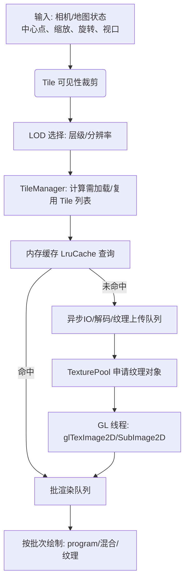
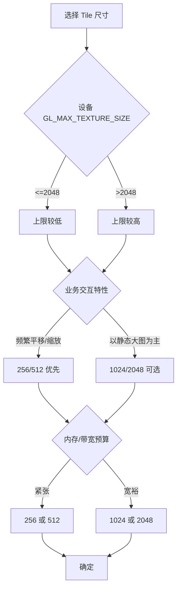

## OpenGL ES 2.0 超大纹理渲染：Tile 化方案白皮书

本文面向 OpenGL ES 2.0 环境，结合本项目现有架构（如 `ljavaopengles20` 中的 `TileManager`, `TexturePool`, `MapLayer` 等），系统阐述超大纹理的 Tile 化渲染方案：包含问题背景、方案对比与选择理由、实现原理、Tile 尺寸选择指南（256/512/1024/2048）、接入步骤、测试用例与调优建议。为避免理解偏差，请先阅读 `docs/需求说明_AI版.md`。

### 1. 背景与约束
- **超大纹理场景**：在线/离线地图、卫星影像、万像素/亿像素级图片、室内/园区超大平面图等。
- **GLES 2.0 限制**：
  - `GL_MAX_TEXTURE_SIZE` 常见为 4096 或 8192（部分低端设备 2048），单张纹理不能超过该尺寸。
  - NPOT 纹理在 ES 2.0 通常可用，但需要注意 wrap 与 mipmap 限制（推荐 `GL_CLAMP_TO_EDGE` + 不启用 mipmap）。
  - 移动设备内存和带宽有限，大纹理上传（`glTexImage2D`）可能引发卡顿。
- **问题本质**：当原始图片远超设备单纹理上限和/或内存带宽承受能力时，必须切片（Tile）与分级（LOD）以按需加载和绘制。

### 2. 方案总览与对比
- **单大纹理直绘**：
  - 优点：实现简单，无拼接问题。
  - 缺点：受 `GL_MAX_TEXTURE_SIZE` 限制；上传超大纹理卡顿；显存占用大，易 OOM。
- **图集（Atlas）**：
  - 优点：减少纹理绑定次数；适合大量小图标/小纹理。
  - 缺点：不适合单体超大影像；更新/替换粒度粗；边界出血、采样管理更复杂。
- **Tile 切片（推荐）**：
  - 优点：
    - 规避单纹理尺寸上限；
    - 按需加载，可见即取，显著降低内存与带宽压力；
    - 便于 LOD（金字塔）管理，缩放时选择合适分辨率；
    - 易于缓存与异步加载，滚动/缩放体验稳定。
  - 缺点：
    - 片数多时 draw call 增加；
    - 需要处理接缝与采样边界；
    - 需要调度和缓存策略（实现复杂度更高）。

综合兼容性、性能和实现可控性，ES 2.0 环境优先选择 Tile 化。

### 3. 为什么选择 Tile 方案
- **兼容性**：天然规避 `GL_MAX_TEXTURE_SIZE`；适配不同 GPU 能力，最大化覆盖低中高端设备。
- **性能与体验**：按需加载、可见优先与 LOD 结合，缩放与平移更顺滑，避免一次性巨量上传阻塞主线程。
- **内存可控**：以 Tile 为粒度进行内存预算、纹理池复用与 LRU 淘汰，抑制峰值波动。
- **工程演进友好**：与现有 `TileManager`, `TexturePool`, `LruCache` 等模块天然契合，易于逐步优化（批渲染、异步、预取等）。

### 4. Tile 方案实现原理（结合现有模块）



- **切片规则**：将原图按固定 Tile 尺寸（如 256/512/1024/2048）裁切，形成二维网格。每个 Tile 记录像素矩形与在地图坐标系中的位置/范围。
- **LOD/金字塔**：为不同缩放层级预生成（或在线生成）多级分辨率切片。当前缩放选择最合适层级，避免过采样/欠采样。
- **可见性裁剪**：将视口 AABB 投影到纹理/地图坐标系，与 Tile AABB 相交测试，筛出候选 Tile 列表。
- **纹理上传**：
  - 后台线程读取磁盘/网络，解码为像素（RGBA 或灰度），将像素缓冲投递到 GL 线程执行 `glTexImage2D` 或 `glTexSubImage2D`。
  - 使用 `TexturePool` 复用 `GLuint texture`，减少频繁创建/销毁。
  - 使用 `LruCache` 管理常用 Tile，结合命中率与时序淘汰策略。
- **接缝处理**：
  - 切片时对每片增加 1px 扩展边（复制邻接像素），采样时设置 `GL_CLAMP_TO_EDGE`，可显著降低缝隙。
  - 禁用 mipmap（或自行 LOD 选择），避免跨片采样。
- **批渲染**：按 program/混合状态/纹理分组排序，尽量减少状态切换与绑定次数。
- **占位与渐进**：未加载 Tile 可绘制棋盘格/纯色占位；Tile 到达后执行淡入过渡，降低跳变突兀感。
- **异常与恢复**：丢失上下文或切到后台后，支持快速重建可见 Tile（保留索引与 LRU，即取即用）。

### 5. Tile 尺寸选择指南（256/512/1024/2048）



- **资源占用估算（RGBA8）**：单片显存约为 \(4 \times N^2\) 字节，N 为 Tile 尺寸。
  - 256：≈ 256 KB/片；绑定/绘制更频繁，但内存小、滚动更细腻。
  - 512：≈ 1 MB/片；常用折中方案。
  - 1024：≈ 4 MB/片；片数少、draw call 少，但上传抖动更明显。
  - 2048：≈ 16 MB/片；逼近很多设备上限，适合高端设备/静态大图。
- **性能权衡**：
  - 小 Tile：I/O 与解码次数多，draw call 多；切换更平滑，内存峰值低，缓存命中更稳。
  - 大 Tile：I/O 与解码次数少，draw call 少；单次上传重，易卡顿，内存峰值高。
- **使用场景建议**：
  - 256：重交互（频繁拖拽/旋转/缩放）、中低端设备、弱网或严格功耗。
  - 512：地图等普适场景的默认首选。
  - 1024：大屏/高端设备、场景相对静态、对丝滑性有要求且带宽允许。
  - 2048：超大静态海报/蓝图/展板，设备上限 ≥ 4096，追求最少拼接。

### 6. GLES 2.0 关键设置
- 纹理参数：`GL_TEXTURE_MIN_FILTER = GL_LINEAR`，`GL_TEXTURE_MAG_FILTER = GL_LINEAR`，`GL_TEXTURE_WRAP_S = GL_CLAMP_TO_EDGE`，`GL_TEXTURE_WRAP_T = GL_CLAMP_TO_EDGE`。
- 不启用 mipmap；使用 LOD 层级选择代替。
- 注意精度限定（`mediump`/`highp`）在片元/顶点着色器中的差异，防止坐标精度导致缝隙。
- 若可用 ETC1 等压缩格式，可在离线阶段对等质量要求较低的底层 LOD 使用压缩减轻带宽（ES 2.0 对 ETC2 不统一）。

### 7. 与现有工程的对齐与接入步骤
以下步骤与本项目模块对应（命名可能以 `ljavaopengles20` 为主）：
1) 在 `TileManager` 配置 Tile 尺寸与 LOD 层级，提供根据视口与缩放计算候选 Tile 的接口。
2) 在 `MapLayer` 的渲染循环中：
   - 进行可见性裁剪，生成本帧 Tile 列表；
   - 查询 `LruCache` 命中；未命中则将加载任务投递异步队列；
   - 将可绘制 Tile 按 program/混合状态分批入队；
   - 统一在 GL 线程执行纹理上传与绘制；
3) `TexturePool` 负责纹理对象申请/归还；`LruCache` 负责缓存替换；
4) 资源加载线程池（I/O+解码）→ 主/GL 线程上传 → 渲染；
5) 打开裁剪与边缘扩展以抑制接缝；必要时使用占位与淡入策略；
6) 指标埋点：
   - 帧时间、GPU 时间、上传耗时、命中率、纹理数/帧、draw call/帧、内存峰值；
7) 面向不同设备集群配置默认 Tile 尺寸与最大 LOD，必要时做自适应降级。

### 8. 测试用例（10 条）
- 用例 1（基础可见裁剪）：输入视口覆盖 3x3 个 Tile，期望仅加载并绘制交叠 Tile，非可见 Tile 不绘制。
- 用例 2（平移连续性）：持续以 60 FPS 横向平移 3 屏宽度，期望无明显卡顿，未命中 Tile 在 100ms 内补齐并淡入。
- 用例 3（缩放 LOD 选择）：从 Z=8 连续缩放至 Z=16，期望各级 LOD 切换无闪烁，细节逐级清晰，无过采样模糊。
- 用例 4（旋转稳定性）：以每秒 45 度旋转 360 度，期望 Tile 选择与拼接正确，无缝隙与撕裂。
- 用例 5（缓存命中率）：往返在同一路径平移 10 次，期望 LruCache 命中率逐次提高，平均上传耗时下降。
- 用例 6（内存上限压力）：在 1GB RAM 设备上使用 1024 Tile，期望内存峰值受控（无 OOM），淘汰策略生效。
- 用例 7（极端设备上限）：在 `GL_MAX_TEXTURE_SIZE=2048` 设备上使用 2048 Tile，期望正确加载与渲染，不越界。
- 用例 8（资源丢失恢复）：切后台 10s 再返回，期望可见 Tile 在 200ms 内恢复渲染，不黑屏。
- 用例 9（弱网或慢 I/O）：模拟加载延迟 300ms，期望占位渲染与渐进策略生效，无主线程卡顿。
- 用例 10（接缝验证）：放大到像素级查看 Tile 边界，期望无明显缝隙，采样边界过渡自然。

### 9. 常见问题与调优
- 闪白/黑块：增加占位与渐进；上传排队到 GL 线程，避免在绘制过程中变更绑定纹理内存。
- 接缝：1px 扩展边 + `GL_CLAMP_TO_EDGE`；统一浮点精度；避免跨片滤波。
- 上传卡顿：拆分为小批量 SubImage；后台解码与内存复用；限制每帧上传预算（例如 < 4MB）。
- draw call 过多：批渲染排序；在安全范围内适当增大 Tile 尺寸；合并相邻同纹理状态的绘制。
- 内存抖动：复用像素缓冲；池化纹理对象；合理 LRU 容量上限。

### 10. 结论与推荐配置
- ES 2.0 环境优先采用 Tile 方案，结合 LOD 与可见性裁剪，能在广泛设备上稳定渲染超大纹理。
- 推荐默认 Tile 尺寸：512；低端/重交互：256；高端/静态大图：1024/2048。
- 关键在于：异步加载、受控上传、纹理/像素缓冲复用、接缝处理与批渲染排序。

如需进一步对齐本项目代码中的类与接口（`TileManager`, `TexturePool`, `MapLayer` 等）的调用示例，可在后续补充“接入示例”章节。

### 11. 动态扩展纹理（以 0,0 为锚点，任意方向扩展）的 Tile 分割与索引

当纹理区域会从原点 `(0,0)` 出发，向上下左右任意方向动态扩展时，推荐采用“全局锚点对齐”的无限网格：
- 以 `(0,0)` 作为全局网格锚点，建立尺寸为 `S` 的固定 Tile 网格，覆盖整个平面；
- Tile 使用整数索引 `(tx, ty)`，允许负数（左/下方向扩展）；
- 任何时刻的有效纹理区域仅是该无限网格上的一个动态 AABB 子集，不会重切以避免抖动与缓存失效。

#### 11.1 索引与坐标映射
- 设 Tile 尺寸为 `S`（像素），任意像素坐标 `(x, y)`（允许为负）对应的 Tile 索引：
  - \( tx = \left\lfloor \frac{x}{S} \right\rfloor \) ，\( ty = \left\lfloor \frac{y}{S} \right\rfloor \)
  - Tile 覆盖的像素范围：\([tx\cdot S, (tx+1)\cdot S) \times [ty\cdot S, (ty+1)\cdot S)\)
  - 注意对负数使用“数学下取整”的 \(\lfloor\cdot\rfloor\)（不要使用向零截断）。
- 对于动态有效区域像素 AABB：\([x_{min}, x_{max}) \times [y_{min}, y_{max})\)，其覆盖的 Tile 索引闭区间：
  - \( tx_{min} = \left\lfloor \frac{x_{min}}{S} \right\rfloor \)
  - \( tx_{max} = \left\lfloor \frac{x_{max}-\varepsilon}{S} \right\rfloor \)（\(\varepsilon\) 取极小正数，避免刚好卡在边界导致多算一列）
  - \( ty_{min}, ty_{max} \) 同理

在 Java/Kotlin 中请慎用整除对负数的语义，可使用双精度配合 `floor` 或显式实现 floorDiv/floorMod。

#### 11.2 LOD 与像素坐标的层级映射
- 设基准层级为 `z0`，在层级 `z` 的像素坐标与基准关系：\( (x_z, y_z) = (x, y) / r_z \) 或 \(\times\) 某比例（视金字塔构建方式而定）。
- 每个层级独立应用上述索引公式，键为 `(z, tx, ty)`；同一世界范围在不同 `z` 下得到不同的 Tile 范围。

#### 11.3 部分 Tile（边缘）处理与 UV 计算
- 对于某个 `(tx, ty)`，其 Tile 像素 AABB：\([X_0, X_1)=[tx\cdot S,(tx+1)\cdot S)\)，\([Y_0, Y_1)\) 同理。
- 与有效区域相交得到 `subRect`：\([sx_0, sx_1) = [\max(X_0, x_{min}), \min(X_1, x_{max}))\)，`y` 同理。
- 纹理上传：
  - 预先分配完整 `S×S` 纹理；对 `subRect` 使用 `glTexSubImage2D` 局部上传；其余未覆盖部分可清零/透明；
  - 为抑制接缝，对 `subRect` 的边界复制 1px 外延像素（若有邻片数据可用）。
- 片内 UV：
  - \( u_0 = \frac{sx_0 - X_0}{S},\quad u_1 = \frac{sx_1 - X_0}{S} \)
  - \( v_0 = \frac{sy_0 - Y_0}{S},\quad v_1 = \frac{sy_1 - Y_0}{S} \)
  - 注意与纹理坐标系的 `y` 方向一致性（必要时翻转 `v`）。

#### 11.4 动态追加数据的调度流程

```mermaid
flowchart TD
    A[输入: 新的有效区域 AABB<br/>(xmin,xmax)*(ymin,ymax)] --> B[计算 tx_min..tx_max, ty_min..ty_max]
    B --> C{遍历每个 (tx,ty)}
    C --> D[求 subRect = TileAABB ∩ 有效区域]
    D --> E{缓存/纹理是否存在?}
    E -->|是| F[若纹理完整/部分已上传, 仅更新差分或直接复用]
    E -->|否| G[分配纹理(复用池) + 异步解码 + glTexSubImage2D]
    F --> H[加入渲染批次, 设置对应 UV]
    G --> H
    H --> I[GPU 渲染]
```

#### 11.5 “锚点对齐”与“滑动切片”的对比
- 锚点对齐（推荐）：网格固定对齐 `(0,0)`，只扩展 Tile 范围；已有 Tile 不重切，缓存稳定，索引可复用。
- 滑动切片：网格随区域移动而重切，易导致缓存大量失效、draw call 波动与可见缝隙，不建议。

#### 11.6 示例（S=512）
- 初始区域：`[0, 1536) × [0, 1024)` → `tx=[0..2]`, `ty=[0..1]` 共 `3×2` 片。
- 左向扩展 `Δx=640`：新 `xmin=-640` → `tx_min=floor(-640/512)=-2`，新增列 `tx=-2,-1`；仅为这些列构建/上传交叠部分。
- 上向扩展 `Δy=300`：新 `ymax=1324` → `ty_max=floor((1324-ε)/512)=2`，新增行 `ty=2`。
- 右向小扩展至 `xmax=1792`：`tx_max=floor((1792-ε)/512)=3`，新增列 `tx=3`。

#### 11.7 实现要点小结
- 全局固定网格 + 负索引支持；
- 统一 floor 规则处理负数；
- 按 AABB 求覆盖索引区间 + 每片求交；
- 部分 Tile 用 `glTexSubImage2D` 局部上传 + 1px 外延；
- UV 取相对 Tile 起点的归一化值；
- LOD 以 `(z, tx, ty)` 为键，层级独立索引；
- 仅为新增覆盖范围调度加载，最大化缓存复用。


