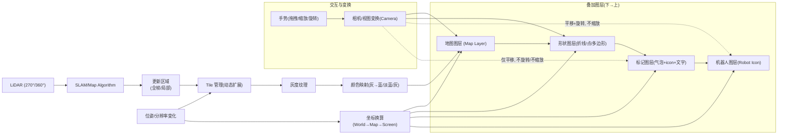

## 需求说明_AI版

### 总览架构图



### 背景与目标
- 背景: 机器人建图系统，算法实时输出灰度地图，上层需要高性能实时预览渲染。
- 目标: 在移动端/嵌入端实现高性能、可交互的实时地图预览，包含地图、机器人、标记点与基础图形层。

### 功能清单（优先级：高→中）
- 地图渲染（高）: 超大纹理 Tile 化；全帧/局部更新；灰度→主题色映射；手势交互；坐标换算。
- 机器人 Icon（高）: 层级最高；随平移/旋转，不随缩放；大小固定。
- 标记点（高）: 2000+；随平移，不随旋转/缩放；样式可配；多语言/RTL/LTR；换行控制。
- 折线（高）: 点集动态；线宽/样式/渐变；交互跟随可配；选中/拖拽可选。
- 离散点（中）: 圆点；半径/颜色可配；是否随缩放可配；不支持选中。
- 多边形（中）: 简单多边形；顶点/边框/填充/渐变；可选中编辑。

### 渲染分层与交互关系
- 分层自下而上: 地图 → 形状（折线/点/多边形） → 标记 → 机器人。
- 交互变换:
  - 地图、形状: 跟随平移/缩放/旋转（线宽/半径是否随缩放可配）。
  - 标记: 仅平移，不旋转/不缩放（屏幕空间对齐）。
  - 机器人: 平移+旋转，不缩放（像素大小固定）。

### 地图渲染与 Tile 管理
- 超大纹理: 地图可达 20000×20000，需 Tile 化，避免超大单纹理。
- 增长模型: 
  - **新建地图**: 一开始纹理大小是0×0或很小的值，随着推图进行逐渐变大，预估每次变化大小512×512
  - **扩展地图**: 一开始纹理大小是某个值（可能200×200，也可能20000×20000），随着推图进行逐渐变大，预估每次变化大小512×512
  - **渐进增长**: 地图尺寸渐进变大，也可能不变
- 更新模式:
  - **全帧更新**: 每帧都渲染整个纹理（**算法生成完整帧纹理的耗时比较长，当前建图算法支持的方案**）
  - **局部更新**: 每帧只更新某个固定大小的正方形区域（**建图算法尚未支持，后续算法更新后采用该方案，算法虽未支持，但是渲染需要提前实现**）
    - 正方形大小可调，也可以是别的形状的区域更新
    - 正方形位置不固定（因为机器人在移动）
    - 地图可能逐渐变大，Tile可能需要增加
- 颜色映射: 灰度（灰/黑/白）→ 蓝/淡蓝/灰主题色，映射表可配；**算法返回的预览地图是灰度图（由灰/黑/白组成），不符合UI设计的效果，UI期望是蓝色/淡蓝色/灰色组成的图，因此，需要做颜色的映射**。
- 手势交互: **需要支持用户的手势操作，单指拖拽平移，双指缩放/旋转**。
- 坐标体系: 维护 World↔Map↔Screen 双向换算；**地图变大的过程中，地图左下角在机器人世界坐标系里的定位位置/resolution（一个像素在机器人世界坐标系里的大小）也是变化的，这个会影响到机器人icon/标记点位置的计算**。
- 视图策略: 
  - **默认全图预览**: 默认情况下，需要预览全图，即缩放纹理使之可以在当前视窗里完整预览
  - **手势交互后**: 用户手势操作（平移/旋转/缩放）后，可能只预览其中的一部分
  - **自动恢复**: 当用户执行缩放操作并结束后，若机器人累计推行距离超过 1m（阈值可配），则自动恢复为"全图预览"

### 输入与数据源
- 数据来源:
  - 来自 `ParcelFileDescriptor` 的字节数组（**动态更新，10帧/s**）：
    - 灰度图数据（Gray8）
    - JPEG 文件数据
  - Android `sdcard` 中的 PNG 文件（**不会动态更新，或者更新频率低**）
- **ParcelFileDescriptor 数据格式**（二进制布局）:
  ```
  [Header: 36 bytes固定]
  - originX: 8字节 double，纹理左下角世界坐标X（米）
  - originY: 8字节 double，纹理左下角世界坐标Y（米）
  - resolution: 8字节 double，像素分辨率（米/像素，如0.05m/px）
  - width: 4字节 int，纹理宽度（像素）
  - height: 4字节 int，纹理高度（像素）
  - area: 4字节 int，地图面积（算法概念，渲染不影响）
  [Payload: 变长]
  - bytes: byte array，纹理像素数据（灰度图或JPEG编码）
  ```
- 统一处理:
  - 上述输入在 IO/解码层统一转为 Gray8（或 RGBA）缓冲后再进入渲染管线，并按区域写入对应 Tile（局部更新时仅写对应区域）。
  - ParcelFileDescriptor 解析后提取坐标原点、分辨率等元数据，用于坐标换算与 Tile 管理。

### 机器人 Icon 规则
- 层级最高，不被遮挡。
- 跟随平移/旋转，不随缩放；屏幕像素尺寸固定。
- 输入: 世界坐标与航向角（或投影后屏幕坐标+朝向）。

### 标记点系统
- 规模: 初始 0~2000+，动态增删，无上限。
  - **新建地图时，初始没有标记点，用户通过交互一个一个添加**
  - **扩展地图时，初始已经存在地图已经有的标记点，可能是0~2000+个，之后，用户通过交互一个一个添加**
  - **不管是新建还是扩展，用户都可以通过交互，一个一个的删除标记点**
- 变换: 仅平移，不随旋转/缩放；保持文字可读。
- 布局: 文字必选；气泡与 icon 可选；icon 与文字相对位置上下/左右可配；30+ 语言，含 RTL/LTR；maxWidth 控制换行（**-1 不换行，默认值就是-1，这个时候不需要进行换行操作，单行显示全部的文字**）。
- 样式: 字体颜色/大小/行距/padding/icon-文字间距；气泡圆角/箭头位置与大小/stroke 颜色宽度/填充色；**支持动态修改某一个或者多个标记点的气泡颜色，icon，文字颜色/大小等参数**。
- 性能: 2000+ 保持流畅（目标 60fps，最低 30fps）。

### 折线、离散点、多边形规则
- **折线**: 
  - 由一系列离散的点连接组成；折线的点支持动态更新
  - 线宽/样式可配，也可以支持渐变的线条颜色
  - 手势操作过程中，折线跟随平移/旋转；可以配置折线的线条宽度是否跟随缩放，默认不跟随
  - **支持用户点击选中操作，选中后，可以平移这个折线（平移过程中，地图是不响应触摸事件的），默认不支持响应点击选中和拖拽**
  - 允许有多个折线，折线与折线之间互相独立
  - 每个折线可以有一个字符串组成的名字，显示用，也可以没有
- **离散点**: 
  - 目前只考虑支持圆形离散的点，也即是，在每个离散的点的位置绘制一个圆
  - 圆的大小/颜色可以通过参数配置，默认红色，半径12个像素
  - 手势操作过程中，圆跟随地图平移/旋转；可以配置圆的半径是否跟随缩放，默认不跟随
  - 离散的点个数可能有2000+，并且动态变化
  - 不支持选中
- **多边形**: 
  - 只考虑支持简单多边形
  - 多边形的样式支持配置，包括各个顶点的样式（可以是一个实心圆，也可以是多个不同颜色的同心圆组成的），border的颜色/宽度/实线or虚线/虚线的间隔，多边形的solid颜色等等，支持配置渐变色
  - 手势操作过程中，多边形跟随地图平移/旋转/缩放；可以配置多边形的border的宽度是否跟随缩放，默认不跟随
  - 多边形个数可能有2000+，并且动态变化
  - **默认不支持选中，如果配置了支持选中，用户点击这个多边形选中后，多边形的单个顶点可以拖拽，用于修改多边形的形状；多边形的中心区可以拖拽整体平移**
  - 每个多边形可以有一个字符串组成的名字，显示用，也可以没有

### 性能与资源约束
- 帧率: 目标 60fps，最低 30fps。
- 纹理与内存: 优先 Tile；避免一次性超大纹理；局部更新减少上传带宽。
- 批处理: 标记点文字/icon 合批；文本缓存与布局缓存；尽量减少状态切换。
- 手势平滑: 插值/节流，避免卡顿。

### 实现原理与最小步骤
1. Tile 管理器: 负责地图尺寸增长、Tile 分配/回收、贴图偏移与对齐。
2. 更新通道: 实现全帧/局部两种上传路径；局部更新按区域写入对应 Tile。
3. 颜色映射: 片元着色器中使用 LUT/三段式阈值将灰度映射蓝系主题色（可热更新）。
4. 变换链路: 维护 World→Map→Screen 矩阵；统一由相机状态驱动。
5. 图层顺序: Map → Shapes → Markers → Robot；严格控制深度测试与混合模式。
6. 标记点屏幕空间渲染: 跟随平移；文本布局缓存；SDF/Hybrid 文本渲染以保证清晰与性能。
7. 合批与实例化: 对点/线/面与标记图元进行批渲染；减少 draw call。
8. 配置化样式: 统一样式中心，支持运行时修改并局部刷新。


### 验收标准
- 新建/扩展地图持续稳定（≥30fps）。
- 全帧与局部更新可切换；局部区域可调，随位姿正确移动/旋转；Tile 动态扩展正确。
- 颜色映射正确；多语言、RTL/LTR 正确；换行与 maxWidth 生效。
- 机器人 icon 随平移/旋转，大小固定，层级最高不被遮挡。
- 2000+ 标记点：随平移、不随旋转/缩放；样式变更实时；≥30fps。
- 折线/点/多边形交互和样式遵循配置；选中/拖拽开启时工作；多对象互不干扰。
- 分辨率变化时坐标换算正确；屏幕位置误差 ≤1px。
- 视图策略落地：用户缩放结束后，机器人累计推行距离超过 1m（阈值可配）时，自动恢复“全图预览”。

### 测试样例（10 组）
1) 新建地图，resolution=0.05m/px，机器人位姿(0,0,0°)，全帧更新1fps → 地图扩大，颜色映射正确；空闲≥30fps。
2) 扩展地图 5000×5000px，局部区域 512×512px，机器人沿 X 正向 1m/s → 区域随前方移动，Tile 扩展无撕裂。
3) 视图缩放 2×，旋转 30°，平移 (100,50)px → 机器人随移/旋转、大小不变；标记仅平移；折线线宽不随缩放（默认）。
4) 2500 标记点批量改文字与气泡色 → 100ms 内完成，≥30fps。
5) 标记点含阿拉伯语与英文 → RTL/LTR 渲染与换行正确，箭头与圆角不冲突。
6) 折线 A(线宽不随缩放) 与 B(线宽随缩放) → 缩放 0.5×/2× 下视觉符合配置。
7) 开启折线选中，点击选中后拖拽 50px → 仅折线移动，地图不响应；命中测试通过。
8) 离散点 3000，半径 12px 不随缩放 → 0.5×/2× 下屏幕半径仍 12px；默认红色。
9) 多边形 2000，边框不随缩放，填充渐变 → 旋转 45°/缩放 1.5× 下边框视觉恒定。
10) resolution 0.05→0.03 m/px → 各对象屏幕位置偏差 ≤1px。

11) 用户缩放至 2× 后松手，机器人持续前进累计 1.2m → 自动恢复为“全图预览”（若阈值配置为 1m），过程流畅无明显掉帧。

### 术语表
| 术语 | 定义 |
|---|---|
| World 坐标 | 机器人世界坐标系（米）。|
| Map 坐标 | 地图像素坐标（px），左下角为原点，随地图扩大而变化。|
| Screen 坐标 | 屏幕像素坐标（px）。|
| resolution | 每像素代表的实际距离（m/px）。|
| Tile | 地图被切分的纹理块，用于管理超大纹理。|
| 全帧更新 | 每帧上传整幅地图纹理。|
| 局部更新 | 每帧仅上传局部区域纹理。|
| 标记点 | 气泡+icon+文字的组合标注，文字必选，其余可选。|
| 形状图层 | 折线、离散点、多边形的统称。|
| 相机/视图变换 | 控制平移/缩放/旋转的统一状态。|
| ParcelFileDescriptor | Android进程间通信机制，包含固定36字节头部（元数据）+ 变长像素数据。|

### 接口草案（Kotlin 伪代码）

```kotlin
data class MapResolution(val metersPerPixel: Float)
data class Pose(val xMeters: Float, val yMeters: Float, val yawDeg: Float)
data class TileCoord(val x: Int, val y: Int)
data class IntRect(val left: Int, val top: Int, val right: Int, val bottom: Int)

// ParcelFileDescriptor 数据解析
data class ParcelMapData(
    val originX: Double,      // 纹理左下角世界坐标X（米）
    val originY: Double,      // 纹理左下角世界坐标Y（米）
    val resolution: Double,   // 像素分辨率（米/像素）
    val width: Int,           // 纹理宽度（像素）
    val height: Int,          // 纹理高度（像素）
    val area: Int,            // 地图面积（算法概念）
    val pixelData: ByteArray  // 纹理像素数据（灰度图或JPEG）
)

interface ParcelDataParser {
    fun parseMapData(parcelFileDescriptor: ParcelFileDescriptor): ParcelMapData
}

sealed class MapUpdate {
    // 从 ParcelFileDescriptor 解析的完整帧更新
    data class FullFrameFromParcel(
        val parcelData: ParcelMapData
    ) : MapUpdate()
    
    // 兼容性全帧更新（用于其他数据源）
    data class FullFrame(
        val widthPx: Int,
        val heightPx: Int,
        val gray8: java.nio.ByteBuffer,
        val worldOriginX: Double,
        val worldOriginY: Double,
        val resolution: MapResolution
    ) : MapUpdate()

    data class Region(
        val regionInMapPx: IntRect,
        val gray8: java.nio.ByteBuffer
    ) : MapUpdate()

    data class Growth(
        val newWidthPx: Int,
        val newHeightPx: Int,
        val addedTiles: List<TileCoord>
    ) : MapUpdate()
}

data class ColorMap(
    val blackColor: Int,
    val grayColor: Int,
    val whiteColor: Int
)

data class CameraState(
    val translationXPx: Float,
    val translationYPx: Float,
    val scale: Float,
    val rotationDeg: Float
)

interface CoordinateConverter {
    fun worldToMap(xMeters: Double, yMeters: Double): Pair<Double, Double>
    fun mapToWorld(xPx: Double, yPx: Double): Pair<Double, Double>
    fun mapToScreen(xPx: Double, yPx: Double, camera: CameraState): Pair<Float, Float>
    fun screenToMap(xPx: Float, yPx: Float, camera: CameraState): Pair<Double, Double>
}

interface MapRenderer {
    fun submitUpdate(update: MapUpdate)
    fun setColorMap(colorMap: ColorMap)
    fun setCamera(camera: CameraState)
    fun render(frameTimeNanos: Long)
}

data class MarkerStyle(
    val textColor: Int,
    val textSizeSp: Float,
    val lineSpacingMultiplier: Float,
    val paddingPx: Int,
    val iconTextGapPx: Int,
    val bubbleCornerRadiusPx: Float,
    val bubbleArrowEnabled: Boolean,
    val bubbleArrowSizePx: Int,
    val bubbleStrokeColor: Int,
    val bubbleStrokeWidthPx: Float,
    val bubbleFillColor: Int,
    val layout: Layout // TOP_BOTTOM or LEFT_RIGHT
)

enum class Layout { TOP_BOTTOM, LEFT_RIGHT }

data class Marker(
    val id: String,
    val worldX: Double,
    val worldY: Double,
    val iconRes: String?,
    val text: String,
    val locale: String,
    val maxWidthPx: Int = -1,
    val style: MarkerStyle
)

interface MarkerManager {
    fun addMarker(marker: Marker)
    fun updateMarker(marker: Marker)
    fun updateMarkerStyle(id: String, style: MarkerStyle)
    fun removeMarker(id: String)
}

data class PolylineOptions(
    val id: String,
    val worldPoints: List<Pair<Double, Double>>,
    val color: Int,
    val widthPx: Float,
    val widthFollowsScale: Boolean = false,
    val gradient: List<Int>? = null
)

data class PointsOptions(
    val id: String,
    val worldPoints: List<Pair<Double, Double>>,
    val color: Int = 0xFFFF0000.toInt(),
    val radiusPx: Float = 12f,
    val radiusFollowsScale: Boolean = false
)

data class PolygonOptions(
    val id: String,
    val worldPoints: List<Pair<Double, Double>>,
    val strokeColor: Int,
    val strokeWidthPx: Float,
    val strokeDashIntervalPx: Float? = null,
    val strokeFollowsScale: Boolean = false,
    val fillColor: Int? = null,
    val fillGradient: List<Int>? = null
)

interface ShapesManager {
    fun addPolyline(options: PolylineOptions)
    fun updatePolyline(options: PolylineOptions)
    fun removePolyline(id: String)

    fun addPoints(options: PointsOptions)
    fun updatePoints(options: PointsOptions)
    fun removePoints(id: String)

    fun addPolygon(options: PolygonOptions)
    fun updatePolygon(options: PolygonOptions)
    fun removePolygon(id: String)
}

interface InteractionConfig {
    var enablePolylineSelection: Boolean
    var enablePolygonSelection: Boolean
}

interface InteractionCallbacks {
    fun onPolylineSelected(id: String)
    fun onPolylineDragged(id: String, dxPx: Float, dypx: Float)
    fun onPolygonSelected(id: String)
    fun onPolygonVertexDragged(id: String, vertexIndex: Int, dxPx: Float, dyPx: Float)
}
```

### 渲染参数配置表

| 类别 | 参数 | 默认值/说明 |
|---|---|---|
| 通用 | 帧率目标 | 60fps（最低 30fps） |
| 通用 | 混合模式 | 预乘 Alpha，按层控制 |
| Tile | Tile 尺寸 | 256/512（可根据设备调整） |
| 更新 | 模式 | 全帧 / 局部（可运行时切换） |
| 更新 | 局部区域大小 | 256~1024 可配；随机器人前方移动 |
| 地图 | 颜色映射 | 黑/灰/白 → 蓝/淡蓝/灰（可 LUT） |
| 相机 | 平移/缩放/旋转 | 统一相机状态驱动，支持插值 |
| 视图 | 自动恢复全图阈值 | 1m（用户缩放结束后，累计位移超出阈值则恢复全图预览，可配） |
| 机器人 | 尺寸 | 屏幕像素固定（如 32~64px） |
| 标记 | 文本 | 颜色/大小/行距/locale/maxWidth |
| 标记 | 气泡 | 圆角/箭头/描边/填充/间距 |
| 标记 | 关系 | icon-文字上下/左右；间距可配 |
| 折线 | 线宽 | px 值；是否随缩放可配 |
| 折线 | 颜色 | 固定色/渐变 |
| 点 | 半径 | 默认 12px；是否随缩放可配 |
| 多边形 | 边框 | 颜色/宽度/虚实/间隔；是否随缩放可配 |
| 多边形 | 填充 | 固定色/渐变 |


